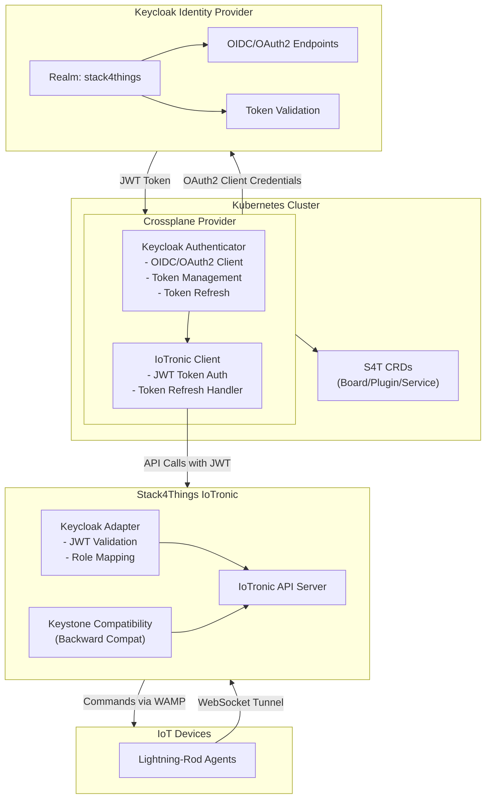
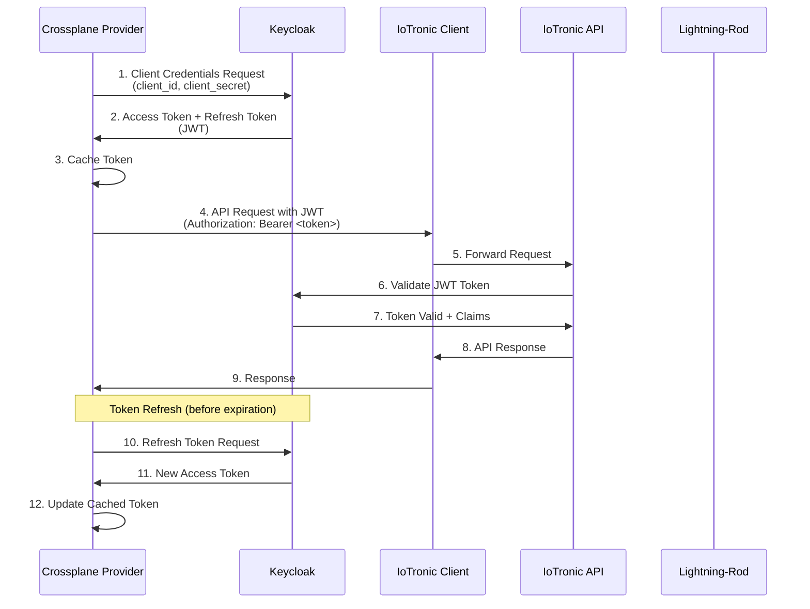
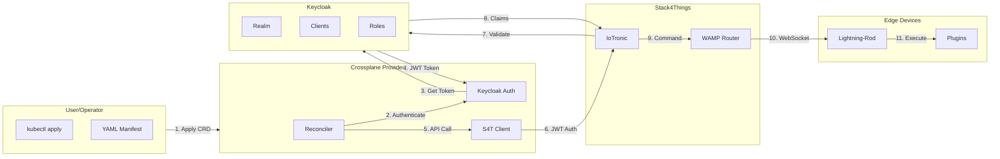
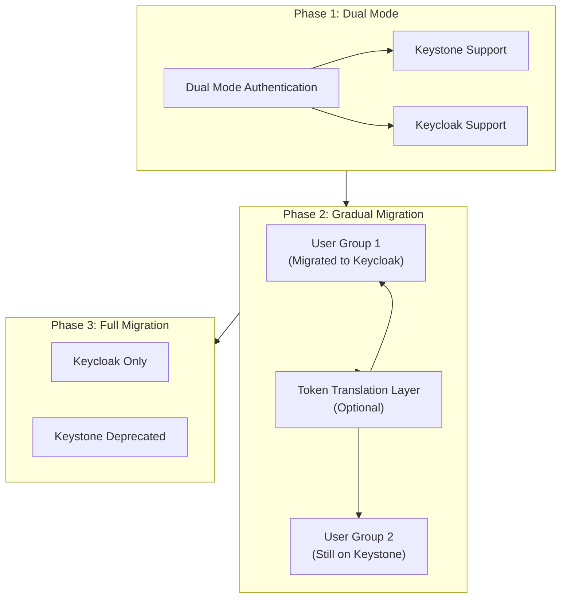

# Project 1: Crossplane Provider for Stack4Things with Keycloak Authentication

## General Information

**Title:** Crossplane Provider for Stack4Things: Migration from Keystone to Keycloak for Unified Authentication

**Level:** Advanced (Master's Thesis)

**Estimated Duration:** 4-6 months

**Required Skills:** Go, Kubernetes, Crossplane SDK, Keycloak, OIDC/OAuth2, Stack4Things API

---

## Context and Motivation

According to Deliverable D1.3, Stack4Things integrates with Crossplane for multi-cloud orchestration. Currently, the Crossplane Provider uses Keystone for authentication with IoTronic. However, this approach presents several limitations:

- **Keystone dependency:** Tightly coupled to OpenStack ecosystem
- **Limited token management:** Tokens without proper expiration mechanisms
- **Authorization limitations:** Difficult to implement fine-grained authorization policies
- **Federation challenges:** Hard to integrate with external Identity Providers

**Objective:** Replace Keystone with Keycloak in the Crossplane Provider, maintaining full compatibility with Stack4Things IoTronic while improving security and flexibility.

---

## Project Objectives

### Main Objective
Modify the Crossplane Provider for Stack4Things to use Keycloak as Identity Provider instead of Keystone, implementing OIDC/OAuth2 authentication for IoTronic API calls.

### Specific Objectives
1. Analyze existing Crossplane Provider and identify Keystone integration points
2. Configure Keycloak as Identity Provider for Stack4Things
3. Implement OIDC/OAuth2 client in Crossplane Provider
4. Develop adapter for IoTronic to accept Keycloak tokens
5. Maintain backward compatibility during migration
6. Implement automatic token refresh mechanism
7. Test end-to-end integration

---

## Technical Description

### 1. Analysis of Existing Crossplane Provider

**Activities:**
- Analyze Crossplane Provider codebase for Stack4Things
- Identify Keystone usage points:
  - Initial authentication
  - Token generation
  - Token validation
  - Authorization checks
- Map IoTronic API calls requiring authentication
- Document current authentication flow

**Deliverable:** Analysis document with Keystone → Keycloak mapping

---

### 2. Keycloak Configuration for Stack4Things

**Activities:**
- Setup dedicated Keycloak realm for Stack4Things
- Configure clients for:
  - Crossplane Provider (confidential client)
  - IoTronic API server (public client)
  - Lightning-Rod agents (service accounts)
- Define roles and permissions:
  - Board management roles
  - Plugin deployment roles
  - Service management roles
  - Read-only roles
- Configure OIDC/OAuth2 flows:
  - Client Credentials flow for service-to-service
  - Authorization Code flow for user interactions
  - Device Flow for headless devices (optional)

**Deliverable:** Keycloak realm configuration export + documentation

---

### 3. Crossplane Provider Modifications

**Components to modify:**

#### 3.1 Authentication Package
```go
// New package: pkg/auth/keycloak
package keycloak

type KeycloakAuthenticator struct {
    clientID     string
    clientSecret string
    realmURL     string
    httpClient   *http.Client
}

func (k *KeycloakAuthenticator) Authenticate(ctx context.Context) (*Token, error)
func (k *KeycloakAuthenticator) RefreshToken(ctx context.Context, refreshToken string) (*Token, error)
func (k *KeycloakAuthenticator) ValidateToken(ctx context.Context, token string) error
```

#### 3.2 Provider Configuration
- Add Keycloak configuration in ProviderConfig:
  - Keycloak server URL
  - Realm name
  - Client ID and Secret
  - Token endpoint
  - Refresh token endpoint

#### 3.3 IoTronic Client Modification
- Modify IoTronic client to:
  - Use JWT tokens from Keycloak instead of Keystone tokens
  - Include token in Authorization header
  - Handle token expiration and automatic refresh
  - Handle authentication errors

**Deliverable:** Modified Crossplane Provider code with Keycloak authentication

---

### 4. IoTronic Adapter for Keycloak

**Activities:**
- Create middleware for IoTronic API server that:
  - Accepts JWT tokens from Keycloak
  - Validates tokens using Keycloak public key
  - Extracts claims (user, roles, permissions)
  - Maps Keycloak roles to Stack4Things permissions
- Modify delegation agent to use Keycloak permissions
- Implement backward compatibility for Keystone tokens (during migration)

**Deliverable:** IoTronic adapter with Keycloak support + Keystone compatibility

---

### 5. Token Management and Refresh

**Activities:**
- Implement token caching in Crossplane Provider
- Automatic token refresh before expiration
- Token rotation for long-running operations
- Secure token storage (Kubernetes Secrets)
- Token revocation support

**Deliverable:** Token management system with automatic refresh

---

### 6. Migration Strategy

**Activities:**
- Implement dual-mode authentication:
  - Accept both Keystone and Keycloak tokens
  - Gradual migration of users
- Token translation layer (optional):
  - Convert Keystone tokens to Keycloak tokens
  - Allow mixed operations during transition
- Migration tooling:
  - Scripts to migrate users from Keystone to Keycloak
  - Migration validation
  - Rollback mechanism

**Deliverable:** Documented migration strategy + migration tooling

---

## Architecture

### System Architecture Diagram



### Authentication Flow Diagram



### Component Interaction Diagram



### Migration Strategy Diagram



---

## Technology Stack

- **Languages:** Go (Crossplane Provider), Python (IoTronic adapter)
- **Frameworks:** Crossplane SDK, Keycloak Admin API
- **Protocols:** OIDC, OAuth2, JWT
- **Infrastructure:** Kubernetes, Keycloak
- **Tooling:** kubectl, Helm, GitOps tools

---

## Expected Deliverables

### Code and Implementation
1. Modified Crossplane Provider with Keycloak authentication
2. IoTronic adapter for Keycloak JWT validation
3. Token management system with automatic refresh
4. Migration tooling and scripts

### Documentation
1. Analysis of existing provider
2. Keycloak configuration guide
3. Migration guide from Keystone to Keycloak
4. API documentation of modifications
5. Deployment guide

### Testing
1. Unit tests for authentication package
2. Integration tests: Crossplane Provider ↔ Keycloak ↔ IoTronic
3. End-to-end tests with complete scenario
4. Performance tests (token refresh, API calls)
5. Security tests (token validation, expiration)

### Use Case
1. Multi-cloud deployment using Crossplane with Keycloak authentication
2. Multi-tenant scenario with role-based access

---

## Evaluation and Metrics

- **Functionality (40%):** Working authentication, token refresh, migration
- **Code Quality (20%):** Test coverage, code review, best practices
- **Documentation (15%):** Guides, API docs, migration documentation
- **Testing (15%):** Unit, integration, e2e tests
- **Presentation (10%):** Demo, presentation of results

---

## Bibliography and References

- `RETROSPECT_Deliverable_D1_3_v2/main_final.tex` - Section "Kubernetes + S4T + Crossplane"
- `AssemblingSmartCPSs/chapter8.tex` - Stack4Things authentication with Keystone
- `AssemblingSmartCPSs/chapter11.tex` - Keycloak usage in SLICES
- Crossplane documentation: https://crossplane.io/docs
- Keycloak documentation: https://www.keycloak.org/documentation

---

## Timeline and Milestones

### Milestone 1 (Month 1): Analysis and Design
- Complete analysis of existing Crossplane Provider
- Design Keycloak integration architecture
- Define migration strategy

### Milestone 2 (Month 2-3): Implementation
- Keycloak configuration
- Crossplane Provider modifications
- IoTronic adapter implementation

### Milestone 3 (Month 4): Testing and Integration
- Unit and integration tests
- End-to-end testing
- Performance and security testing

### Milestone 4 (Month 5-6): Migration and Documentation
- Migration tooling development
- Complete documentation
- Final testing and validation

---

## Success Criteria

1. ✅ Crossplane Provider successfully authenticates with Keycloak
2. ✅ All IoTronic API calls work with Keycloak tokens
3. ✅ Token refresh works automatically
4. ✅ Migration from Keystone is possible without downtime
5. ✅ All tests pass (unit, integration, e2e)
6. ✅ Documentation is complete and accurate
7. ✅ Performance is acceptable (<100ms overhead for authentication)

---

## Notes

This project focuses specifically on the Crossplane Provider integration with Stack4Things, exploring the migration from Keystone to Keycloak while maintaining compatibility with existing Stack4Things infrastructure.

