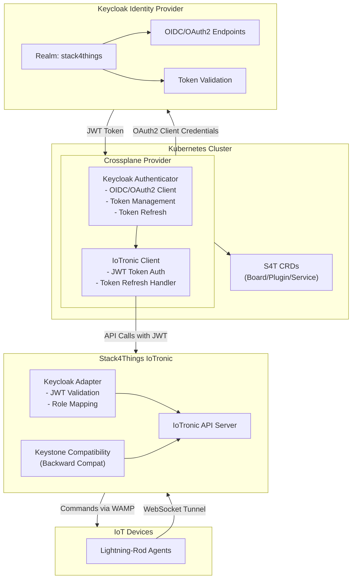
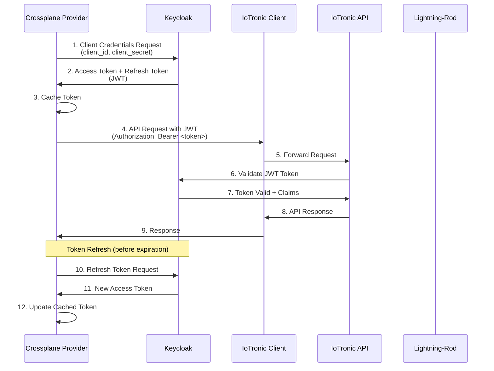
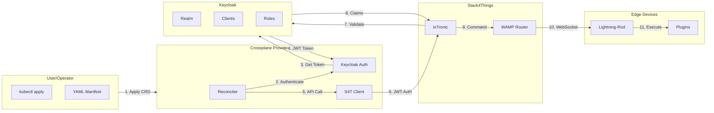
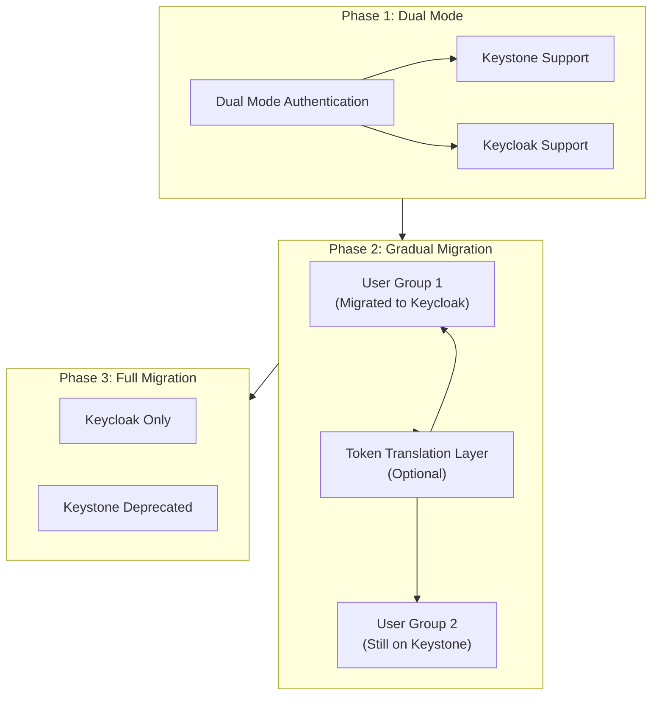

# Project 1: Crossplane Provider for Stack4Things with Keycloak Authentication

## General Information

**Title:** Crossplane Provider for Stack4Things: Migration from Keystone to Keycloak for Unified Authentication

**Required Skills:** Go, Kubernetes, Crossplane SDK, Keycloak, OIDC/OAuth2, Stack4Things API

---

## Context and Motivation

According to Deliverable D1.3, Stack4Things integrates with Crossplane for multi-cloud orchestration. Currently, the Crossplane Provider uses Keystone for authentication with IoTronic. However, this approach presents several limitations:

- **Keystone dependency:** Tightly coupled to OpenStack ecosystem
- **Limited token management:** Tokens without proper expiration mechanisms
- **Authorization limitations:** Difficult to implement fine-grained authorization policies
- **Federation challenges:** Hard to integrate with external Identity Providers

**Objective:** Replace Keystone with Keycloak in the Crossplane Provider, maintaining full compatibility with Stack4Things IoTronic while improving security and flexibility.

---

## Project Objectives

### Main Objective
Modify the Crossplane Provider for Stack4Things to use Keycloak as Identity Provider instead of Keystone, implementing OIDC/OAuth2 authentication for IoTronic API calls.

### Specific Objectives
1. Analyze existing Crossplane Provider and identify Keystone integration points
2. Configure Keycloak as Identity Provider for Stack4Things
3. Implement OIDC/OAuth2 client in Crossplane Provider
4. Develop adapter for IoTronic to accept Keycloak tokens
5. Maintain backward compatibility during migration
6. Implement automatic token refresh mechanism
7. Test end-to-end integration

---

## Technical Description

### 1. Analysis of Existing Crossplane Provider

**Activities:**
- Clone and analyze the existing Crossplane Provider repository (`https://github.com/MIKE9708/Provider4_S4T.git`)
- Clone and analyze the Stack4Things SDK repository (`https://github.com/MIKE9708/s4t-sdk-go.git`)
- Identify Keystone usage points:
  - Initial authentication in SDK (`pkg/api/client.go::Authenticate()`)
  - Token generation (`/v3/auth/tokens` endpoint)
  - Token storage and usage (`X-Auth-Token` header)
  - Configuration structure (`pkg/read_conf/configuration.go`)
- Map IoTronic API calls requiring authentication (all methods in `board_api.go`, `plugin_api.go`, `service_api.go`)
- Analyze Provider controller implementations (`internal/controller/*.go`)
- Document current authentication flow and dependencies
- Identify all files requiring modification

**Deliverable:** Analysis document with Keystone → Keycloak mapping, including specific file locations and modification points

---

### 2. Keycloak Configuration for Stack4Things

**Activities:**
- Setup dedicated Keycloak realm for Stack4Things
- Configure clients for:
  - Crossplane Provider (confidential client)
  - IoTronic API server (public client)
  - Lightning-Rod agents (service accounts)
- Define roles and permissions:
  - Board management roles
  - Plugin deployment roles
  - Service management roles
  - Read-only roles
- Configure OIDC/OAuth2 flows:
  - Client Credentials flow for service-to-service
  - Authorization Code flow for user interactions
  - Device Flow for headless devices (optional)

**Deliverable:** Keycloak realm configuration export + documentation

---

### 3. Crossplane Provider Modifications

**Components to modify:**

#### 3.1 SDK Authentication Package (`s4t-sdk-go`)
The SDK currently uses Keystone authentication. Modify `pkg/api/client.go`:

**Current implementation (Keystone):**
```go
func (c *Client) Authenticate(client *Client, auth_req *read_config.AuthRequest_1) (string, error) {
    // POST to /v3/auth/tokens (Keystone endpoint)
    // Returns X-Subject-Token header
}
```

**New implementation (Keycloak):**
```go
// New package: pkg/auth/keycloak
package keycloak

type KeycloakAuthenticator struct {
    clientID     string
    clientSecret string
    realmURL     string
    httpClient   *http.Client
}

func (k *KeycloakAuthenticator) Authenticate(ctx context.Context) (*Token, error) {
    // POST to {realmURL}/protocol/openid-connect/token
    // Use client credentials flow
    // Returns JWT access token + refresh token
}
func (k *KeycloakAuthenticator) RefreshToken(ctx context.Context, refreshToken string) (*Token, error)
func (k *KeycloakAuthenticator) ValidateToken(ctx context.Context, token string) error
```

**Modify API client methods** to use `Authorization: Bearer <jwt_token>` instead of `X-Auth-Token` header.

#### 3.2 Provider Configuration (`Provider4_S4T`)
- Add Keycloak configuration in ProviderConfig CRD (`api/v1alpha1/providerconfig_types.go`):
  - Keycloak server URL
  - Realm name
  - Client ID and Secret (stored in Kubernetes Secrets)
  - Token endpoint
  - Refresh token endpoint

#### 3.3 Controller Modifications (`Provider4_S4T/internal/controller/`)
- Modify controllers (board_controller.go, plugin_controller.go, service_controller.go) to:
  - Initialize Keycloak authenticator from ProviderConfig
  - Use JWT tokens from Keycloak instead of Keystone tokens
  - Handle token expiration and automatic refresh
  - Handle authentication errors and retries

**Deliverable:** Modified Crossplane Provider code with Keycloak authentication

---

### 4. IoTronic Adapter for Keycloak

**Activities:**
- Create middleware for IoTronic API server that:
  - Accepts JWT tokens from Keycloak
  - Validates tokens using Keycloak public key
  - Extracts claims (user, roles, permissions)
  - Maps Keycloak roles to Stack4Things permissions
- Modify delegation agent to use Keycloak permissions
- Implement backward compatibility for Keystone tokens (during migration)

**Deliverable:** IoTronic adapter with Keycloak support + Keystone compatibility

---

### 5. Token Management and Refresh

**Activities:**
- Implement token caching in Crossplane Provider
- Automatic token refresh before expiration
- Token rotation for long-running operations
- Secure token storage (Kubernetes Secrets)
- Token revocation support

**Deliverable:** Token management system with automatic refresh

---

### 6. Migration Strategy

**Activities:**
- Implement dual-mode authentication:
  - Accept both Keystone and Keycloak tokens
  - Gradual migration of users
- Token translation layer (optional):
  - Convert Keystone tokens to Keycloak tokens
  - Allow mixed operations during transition
- Migration tooling:
  - Scripts to migrate users from Keystone to Keycloak
  - Migration validation
  - Rollback mechanism

**Deliverable:** Documented migration strategy + migration tooling

---

## Architecture

### System Architecture Diagram



### Authentication Flow Diagram



### Component Interaction Diagram



### Migration Strategy Diagram



---

## Technology Stack

- **Languages:** Go (Crossplane Provider), Python (IoTronic adapter)
- **Frameworks:** Crossplane SDK, Keycloak Admin API
- **Protocols:** OIDC, OAuth2, JWT
- **Infrastructure:** Kubernetes, Keycloak
- **Tooling:** kubectl, Helm, GitOps tools

---

## Expected Deliverables

### Code and Implementation
1. Modified Crossplane Provider with Keycloak authentication
2. IoTronic adapter for Keycloak JWT validation
3. Token management system with automatic refresh
4. Migration tooling and scripts

### Documentation
1. Analysis of existing provider
2. Keycloak configuration guide
3. Migration guide from Keystone to Keycloak
4. API documentation of modifications
5. Deployment guide

### Testing
1. Unit tests for authentication package
2. Integration tests: Crossplane Provider ↔ Keycloak ↔ IoTronic
3. End-to-end tests with complete scenario
4. Performance tests (token refresh, API calls)
5. Security tests (token validation, expiration)

### Use Case
1. Multi-cloud deployment using Crossplane with Keycloak authentication
2. Multi-tenant scenario with role-based access

---

## Bibliography and References

### Stack4Things Repositories and Documentation
- Stack4Things GitHub: https://github.com/MDSLab/Stack4Things
- Stack4Things IoTronic API Documentation: https://github.com/MDSLab/iotronic

### Existing Implementation Repositories (To Be Modified)
- **Stack4Things SDK for Go** (`https://github.com/MIKE9708/s4t-sdk-go.git`): 
  - Go SDK library for interacting with Stack4Things IoTronic API
  - Currently implements Keystone authentication (`/v3/auth/tokens` endpoint)
  - Uses `X-Auth-Token` header for API requests
  - Provides client methods for Board, Plugin, and Service management
  - **Modification required**: Replace Keystone authentication with Keycloak OIDC/OAuth2 client credentials flow
  - **Key files to modify**: `pkg/api/client.go` (authentication logic), `pkg/read_conf/configuration.go` (auth request structure)

- **Crossplane Provider for Stack4Things** (`https://github.com/MIKE9708/Provider4_S4T.git`):
  - Kubernetes Crossplane Provider implementing Stack4Things resources as CRDs
  - Defines CRDs for Board, Plugin, and Service resources
  - Uses `s4t-sdk-go` as dependency for Stack4Things API interactions
  - Implements Kubernetes controllers for resource reconciliation
  - **Modification required**: Update Provider configuration to use Keycloak credentials, modify SDK usage to handle Keycloak tokens
  - **Key files to modify**: `internal/controller/*.go` (controller implementations), `api/v1alpha1/*.go` (CRD definitions and ProviderConfig)

### Crossplane Documentation
- Crossplane Official Documentation: https://crossplane.io/docs
- Crossplane Provider Development Guide: https://crossplane.io/docs/v1.11/concepts/providers
- Crossplane SDK Documentation: https://github.com/crossplane/crossplane
- Crossplane Provider Configuration: https://crossplane.io/docs/v1.11/concepts/provider-config
- Crossplane Resource Reconciliation: https://crossplane.io/docs/v1.11/concepts/managed-resources
- Crossplane Composition Functions: https://crossplane.io/docs/v1.11/concepts/composition-functions

### Keycloak Documentation
- Keycloak Official Documentation: https://www.keycloak.org/documentation
- Keycloak Server Administration Guide: https://www.keycloak.org/docs/latest/server_admin/
- Keycloak Authorization Services: https://www.keycloak.org/docs/latest/authorization_services/
- Keycloak Admin REST API: https://www.keycloak.org/docs-api/latest/rest-api/
- Keycloak Java Adapter: https://www.keycloak.org/docs/latest/securing_apps/
- Keycloak OIDC/OAuth2 Configuration: https://www.keycloak.org/docs/latest/securing_apps/

### OIDC/OAuth2 Standards and Protocols
- RFC 6749 - OAuth 2.0 Authorization Framework: https://datatracker.ietf.org/doc/html/rfc6749
- RFC 6750 - OAuth 2.0 Bearer Token Usage: https://datatracker.ietf.org/doc/html/rfc6750
- RFC 7519 - JSON Web Token (JWT): https://datatracker.ietf.org/doc/html/rfc7519
- OpenID Connect Core 1.0: https://openid.net/specs/openid-connect-core-1_0.html
- OAuth 2.0 Device Flow (RFC 8628): https://datatracker.ietf.org/doc/html/rfc8628
- OAuth 2.0 Token Introspection (RFC 7662): https://datatracker.ietf.org/doc/html/rfc7662

### Kubernetes Documentation
- Kubernetes Custom Resource Definitions: https://kubernetes.io/docs/concepts/extend-kubernetes/api-extension/custom-resources/
- Kubernetes Controller Pattern: https://kubernetes.io/docs/concepts/architecture/controller/
- Kubernetes API Server Authentication: https://kubernetes.io/docs/reference/access-authn-authz/authentication/
- Kubernetes RBAC Authorization: https://kubernetes.io/docs/reference/access-authn-authz/rbac/
- Kubernetes Service Accounts: https://kubernetes.io/docs/concepts/security/service-accounts/

### Go Programming Language
- Go Official Documentation: https://go.dev/doc/
- Go OAuth2 Client Library: https://pkg.go.dev/golang.org/x/oauth2
- Go JWT Libraries: https://github.com/golang-jwt/jwt
- Go HTTP Client: https://pkg.go.dev/net/http

### Python Libraries (for IoTronic Adapter)
- Python Requests Library: https://docs.python-requests.org/
- Python JWT Library: https://pyjwt.readthedocs.io/
- Python Keycloak Admin Client: https://python-keycloak.readthedocs.io/

### Additional Resources
- OpenStack Keystone Documentation: https://docs.openstack.org/keystone/
- WebSocket Protocol (RFC 6455): https://datatracker.ietf.org/doc/html/rfc6455
- WAMP Protocol Documentation: https://wamp-proto.org/
- Stack4Things WAMP Integration: https://github.com/MDSLab/Stack4Things/wiki

---

## Notes

This project focuses specifically on the Crossplane Provider integration with Stack4Things, exploring the migration from Keystone to Keycloak while maintaining compatibility with existing Stack4Things infrastructure.

