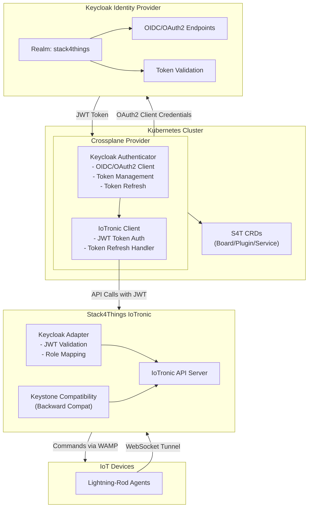
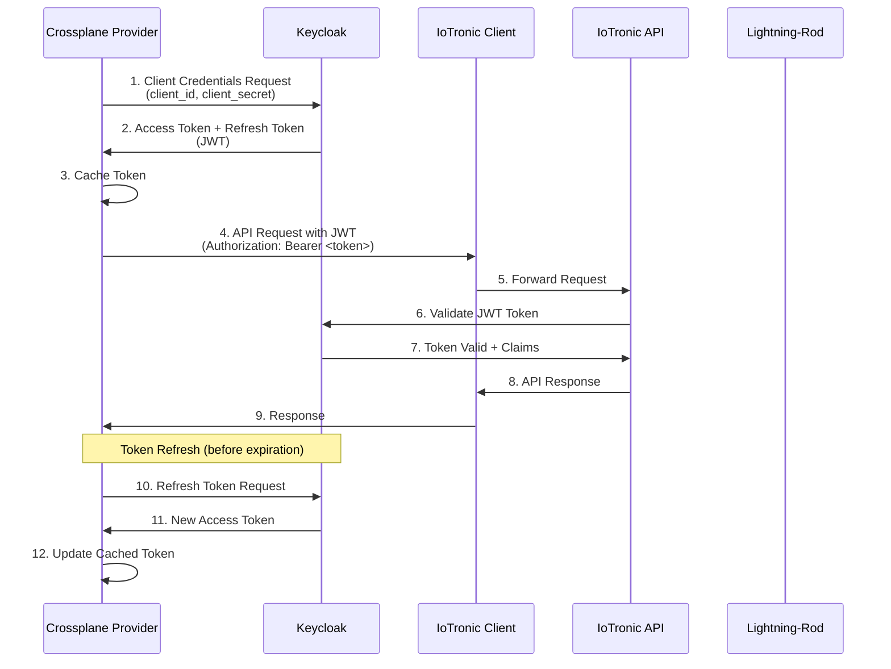
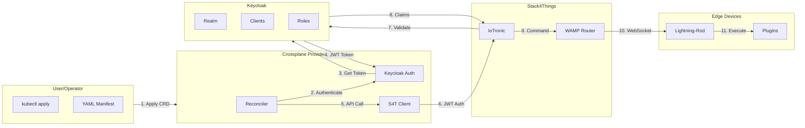
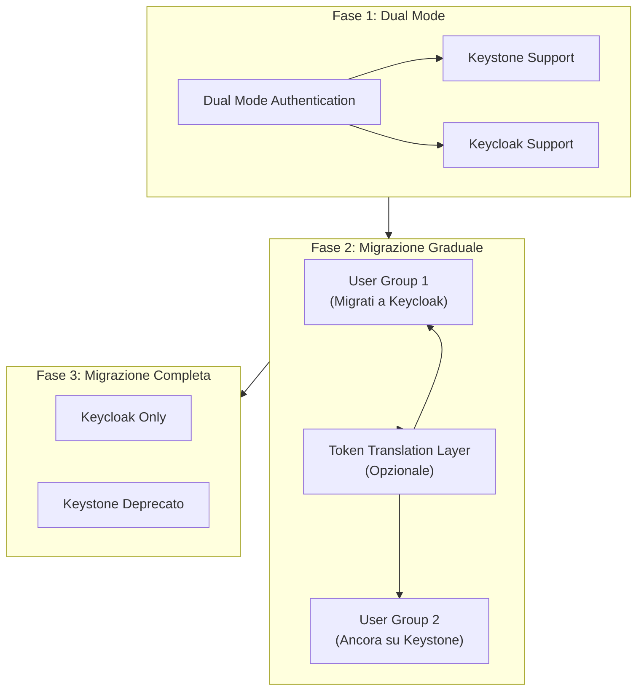

# Progetto 1: Crossplane Provider per Stack4Things con Autenticazione Keycloak

## Informazioni Generali

**Titolo:** Crossplane Provider per Stack4Things: Migrazione da Keystone a Keycloak per Autenticazione Unificata

**Livello:** Avanzato (Tesi Magistrale)

**Durata Stimata:** 4-6 mesi

**Competenze Richieste:** Go, Kubernetes, Crossplane SDK, Keycloak, OIDC/OAuth2, Stack4Things API

---

## Contesto e Motivazione

Dal Deliverable D1.3, Stack4Things si integra con Crossplane per l'orchestrazione multi-cloud. Attualmente, il Crossplane Provider utilizza Keystone per l'autenticazione con IoTronic. Tuttavia, questo approccio presenta diverse limitazioni:

- **Dipendenza da Keystone:** Fortemente accoppiato all'ecosistema OpenStack
- **Gestione token limitata:** Token senza meccanismi di expiration adeguati
- **Limitazioni autorizzazione:** Difficile implementare politiche di autorizzazione fine-grained
- **Sfide federazione:** Difficile integrazione con Identity Provider esterni

**Obiettivo:** Sostituire Keystone con Keycloak nel Crossplane Provider, mantenendo piena compatibilità con Stack4Things IoTronic migliorando sicurezza e flessibilità.

---

## Obiettivi del Progetto

### Obiettivo Principale
Modificare il Crossplane Provider per Stack4Things per utilizzare Keycloak come Identity Provider al posto di Keystone, implementando autenticazione OIDC/OAuth2 per chiamate API IoTronic.

### Obiettivi Specifici
1. Analizzare il Crossplane Provider esistente e identificare i punti di integrazione con Keystone
2. Configurare Keycloak come Identity Provider per Stack4Things
3. Implementare client OIDC/OAuth2 nel Crossplane Provider
4. Sviluppare adapter per IoTronic che accetti token Keycloak
5. Mantenere backward compatibility durante la migrazione
6. Implementare meccanismo di refresh automatico dei token
7. Testare l'integrazione end-to-end

---

## Descrizione Tecnica

### 1. Analisi del Crossplane Provider Esistente

**Attività:**
- Analizzare il codice del Crossplane Provider per Stack4Things
- Identificare dove viene utilizzato Keystone:
  - Autenticazione iniziale
  - Generazione token
  - Validazione token
  - Controlli di autorizzazione
- Mappare le chiamate API IoTronic che richiedono autenticazione
- Documentare il flusso di autenticazione attuale

**Deliverable:** Documento di analisi con mappatura Keystone → Keycloak

---

### 2. Configurazione Keycloak per Stack4Things

**Attività:**
- Setup realm Keycloak dedicato per Stack4Things
- Configurazione client per:
  - Crossplane Provider (confidential client)
  - IoTronic API server (public client)
  - Lightning-Rod agents (service accounts)
- Definizione ruoli e permessi:
  - Ruoli di gestione board
  - Ruoli di deployment plugin
  - Ruoli di gestione servizi
  - Ruoli read-only
- Configurazione flow OIDC/OAuth2:
  - Client Credentials flow per service-to-service
  - Authorization Code flow per interazioni utente
  - Device Flow per dispositivi headless (opzionale)

**Deliverable:** Export configurazione realm Keycloak + documentazione

---

### 3. Modifiche al Crossplane Provider

**Componenti da modificare:**

#### 3.1 Authentication Package
```go
// Nuovo package: pkg/auth/keycloak
package keycloak

type KeycloakAuthenticator struct {
    clientID     string
    clientSecret string
    realmURL     string
    httpClient   *http.Client
}

func (k *KeycloakAuthenticator) Authenticate(ctx context.Context) (*Token, error)
func (k *KeycloakAuthenticator) RefreshToken(ctx context.Context, refreshToken string) (*Token, error)
func (k *KeycloakAuthenticator) ValidateToken(ctx context.Context, token string) error
```

#### 3.2 Provider Configuration
- Aggiungere configurazione Keycloak nel ProviderConfig:
  - URL server Keycloak
  - Nome realm
  - Client ID e Secret
  - Token endpoint
  - Refresh token endpoint

#### 3.3 Modifica IoTronic Client
- Modificare il client IoTronic per:
  - Usare token JWT da Keycloak invece di token Keystone
  - Includere token nell'header Authorization
  - Gestire expiration token e refresh automatico
  - Gestire errori di autenticazione

**Deliverable:** Codice modificato del Crossplane Provider con autenticazione Keycloak

---

### 4. Adapter IoTronic per Keycloak

**Attività:**
- Creare middleware per IoTronic API server che:
  - Accetti token JWT da Keycloak
  - Validi token usando la chiave pubblica Keycloak
  - Estragga claims (user, roles, permissions)
  - Mappi ruoli Keycloak su permessi Stack4Things
- Modificare delegation agent per usare permessi Keycloak
- Implementare backward compatibility per token Keystone (durante migrazione)

**Deliverable:** Adapter IoTronic con supporto Keycloak + compatibilità Keystone

---

### 5. Gestione Token e Refresh

**Attività:**
- Implementare caching token nel Crossplane Provider
- Refresh automatico token prima dell'expiration
- Rotazione token per operazioni long-running
- Storage sicuro token (Kubernetes Secrets)
- Supporto revoca token

**Deliverable:** Sistema di gestione token con refresh automatico

---

### 6. Strategia di Migrazione

**Attività:**
- Implementare autenticazione dual-mode:
  - Accettare sia token Keystone che Keycloak
  - Migrazione graduale degli utenti
- Token translation layer (opzionale):
  - Convertire token Keystone in token Keycloak
  - Permettere operazioni miste durante la transizione
- Tooling per migrazione:
  - Script per migrare utenti da Keystone a Keycloak
  - Validazione migrazione
  - Meccanismo di rollback

**Deliverable:** Strategia di migrazione documentata + tooling per migrazione

---

## Architettura

### Diagramma Architettura Sistema



### Diagramma Flusso Autenticazione



### Diagramma Interazione Componenti



### Diagramma Strategia Migrazione



---

## Stack Tecnologico

- **Linguaggi:** Go (Crossplane Provider), Python (adapter IoTronic)
- **Framework:** Crossplane SDK, Keycloak Admin API
- **Protocolli:** OIDC, OAuth2, JWT
- **Infrastruttura:** Kubernetes, Keycloak
- **Tooling:** kubectl, Helm, GitOps tools

---

## Deliverable Attesi

### Codice e Implementazione
1. Crossplane Provider modificato con autenticazione Keycloak
2. Adapter IoTronic per validazione JWT Keycloak
3. Sistema di gestione token con refresh automatico
4. Tooling e script per migrazione

### Documentazione
1. Analisi del provider esistente
2. Guida configurazione Keycloak
3. Guida migrazione da Keystone a Keycloak
4. Documentazione API delle modifiche
5. Guida deployment

### Testing
1. Unit test per authentication package
2. Test di integrazione: Crossplane Provider ↔ Keycloak ↔ IoTronic
3. Test end-to-end con scenario completo
4. Test di performance (token refresh, chiamate API)
5. Test di sicurezza (validazione token, expiration)

### Use Case
1. Deployment multi-cloud usando Crossplane con autenticazione Keycloak
2. Scenario multi-tenant con accesso role-based

---

## Valutazione e Metriche

- **Funzionalità (40%):** Autenticazione funzionante, token refresh, migrazione
- **Qualità Codice (20%):** Test coverage, code review, best practices
- **Documentazione (15%):** Guide, API docs, documentazione migrazione
- **Testing (15%):** Unit, integration, e2e tests
- **Presentazione (10%):** Demo, presentazione risultati

---

## Bibliografia e Riferimenti

- `RETROSPECT_Deliverable_D1_3_v2/main_final.tex` - Sezione "Kubernetes + S4T + Crossplane"
- `AssemblingSmartCPSs/chapter8.tex` - Autenticazione Stack4Things con Keystone
- `AssemblingSmartCPSs/chapter11.tex` - Uso Keycloak in SLICES
- Documentazione Crossplane: https://crossplane.io/docs
- Documentazione Keycloak: https://www.keycloak.org/documentation

---

## Timeline e Milestone

### Milestone 1 (Mese 1): Analisi e Design
- Completare analisi Crossplane Provider esistente
- Design architettura integrazione Keycloak
- Definire strategia di migrazione

### Milestone 2 (Mese 2-3): Implementazione
- Configurazione Keycloak
- Modifiche Crossplane Provider
- Implementazione adapter IoTronic

### Milestone 3 (Mese 4): Testing e Integrazione
- Test unitari e di integrazione
- Test end-to-end
- Test di performance e sicurezza

### Milestone 4 (Mese 5-6): Migrazione e Documentazione
- Sviluppo tooling migrazione
- Documentazione completa
- Test finale e validazione

---

## Criteri di Successo

1. ✅ Crossplane Provider autentica correttamente con Keycloak
2. ✅ Tutte le chiamate API IoTronic funzionano con token Keycloak
3. ✅ Token refresh funziona automaticamente
4. ✅ Migrazione da Keystone è possibile senza downtime
5. ✅ Tutti i test passano (unit, integration, e2e)
6. ✅ Documentazione è completa e accurata
7. ✅ Performance è accettabile (<100ms overhead per autenticazione)

---

## Note

Questo progetto si concentra specificamente sull'integrazione del Crossplane Provider con Stack4Things, esplorando la migrazione da Keystone a Keycloak mantenendo la compatibilità con l'infrastruttura Stack4Things esistente.

