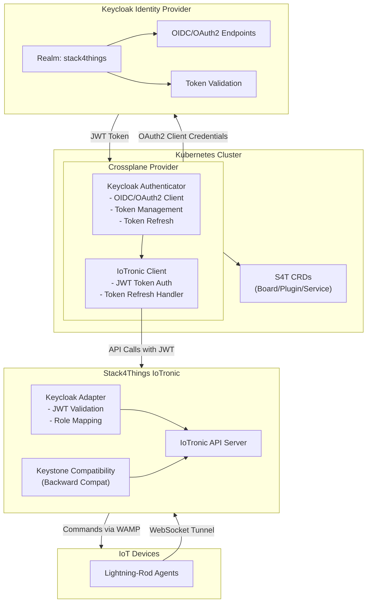
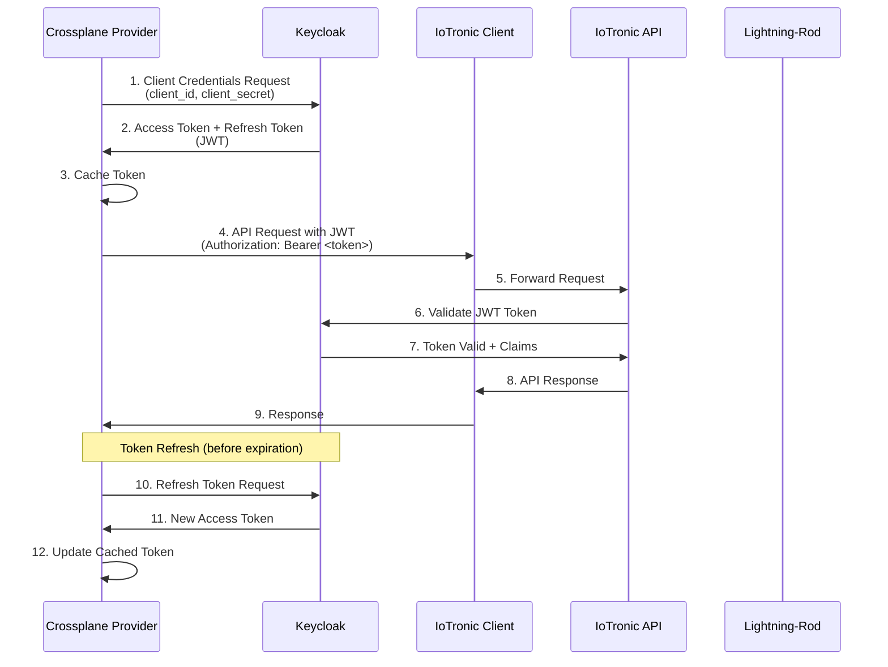
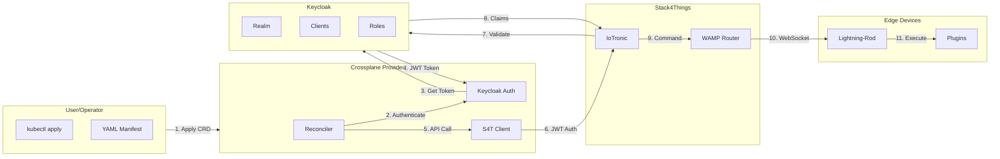
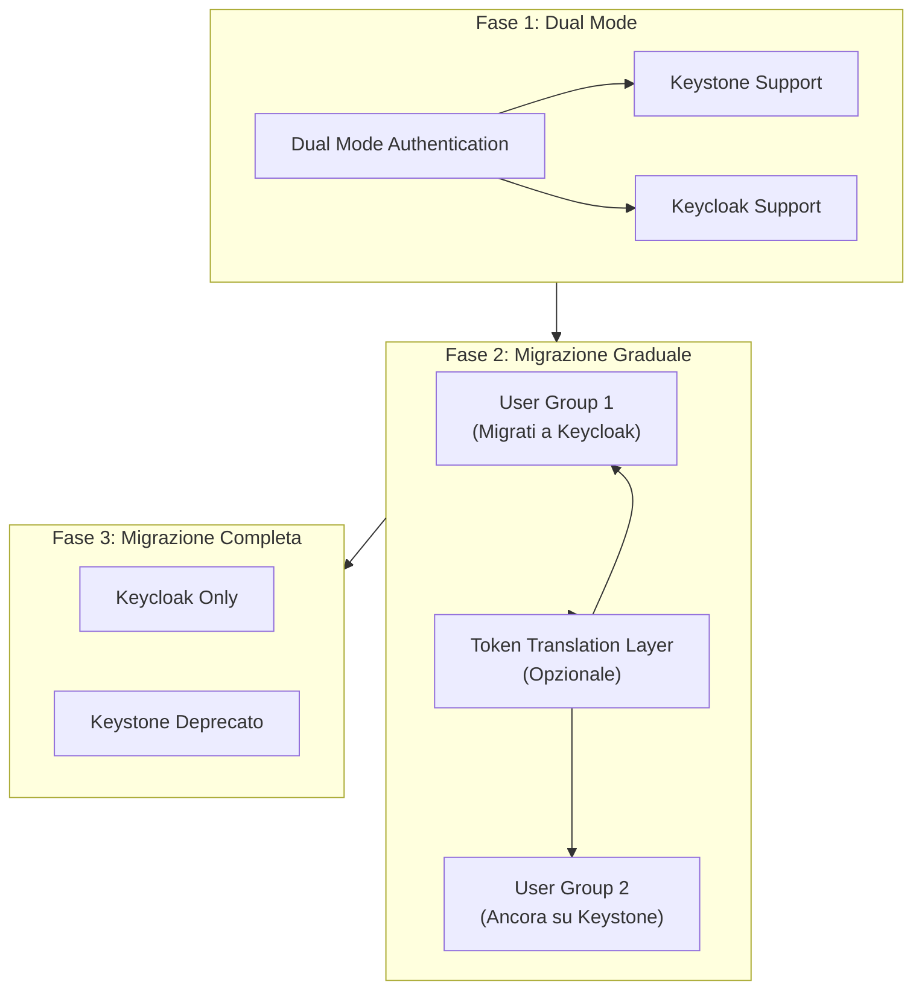

# Progetto 1: Crossplane Provider per Stack4Things con Autenticazione Keycloak

## Informazioni Generali

**Titolo:** Crossplane Provider per Stack4Things: Migrazione da Keystone a Keycloak per Autenticazione Unificata

**Competenze Richieste:** Go, Kubernetes, Crossplane SDK, Keycloak, OIDC/OAuth2, Stack4Things API

---

## Contesto e Motivazione

Dal Deliverable D1.3, Stack4Things si integra con Crossplane per l'orchestrazione multi-cloud. Attualmente, il Crossplane Provider utilizza Keystone per l'autenticazione con IoTronic. Tuttavia, questo approccio presenta diverse limitazioni:

- **Dipendenza da Keystone:** Fortemente accoppiato all'ecosistema OpenStack
- **Gestione token limitata:** Token senza meccanismi di expiration adeguati
- **Limitazioni autorizzazione:** Difficile implementare politiche di autorizzazione fine-grained
- **Sfide federazione:** Difficile integrazione con Identity Provider esterni

**Obiettivo:** Sostituire Keystone con Keycloak nel Crossplane Provider, mantenendo piena compatibilità con Stack4Things IoTronic migliorando sicurezza e flessibilità.

---

## Obiettivi del Progetto

### Obiettivo Principale
Modificare il Crossplane Provider per Stack4Things per utilizzare Keycloak come Identity Provider al posto di Keystone, implementando autenticazione OIDC/OAuth2 per chiamate API IoTronic.

### Obiettivi Specifici
1. Analizzare il Crossplane Provider esistente e identificare i punti di integrazione con Keystone
2. Configurare Keycloak come Identity Provider per Stack4Things
3. Implementare client OIDC/OAuth2 nel Crossplane Provider
4. Sviluppare adapter per IoTronic che accetti token Keycloak
5. Mantenere backward compatibility durante la migrazione
6. Implementare meccanismo di refresh automatico dei token
7. Testare l'integrazione end-to-end

---

## Descrizione Tecnica

### 1. Analisi del Crossplane Provider Esistente

**Attività:**
- Clonare e analizzare repository Crossplane Provider esistente (`https://github.com/MIKE9708/Provider4_S4T.git`)
- Clonare e analizzare repository Stack4Things SDK (`https://github.com/MIKE9708/s4t-sdk-go.git`)
- Identificare punti di utilizzo Keystone:
  - Autenticazione iniziale nello SDK (`pkg/api/client.go::Authenticate()`)
  - Generazione token (endpoint `/v3/auth/tokens`)
  - Memorizzazione e uso token (header `X-Auth-Token`)
  - Struttura configurazione (`pkg/read_conf/configuration.go`)
- Mappare chiamate API IoTronic che richiedono autenticazione (tutti i metodi in `board_api.go`, `plugin_api.go`, `service_api.go`)
- Analizzare implementazioni controller Provider (`internal/controller/*.go`)
- Documentare flusso autenticazione attuale e dipendenze
- Identificare tutti i file che richiedono modifica

**Deliverable:** Documento di analisi con mappatura Keystone → Keycloak, incluse posizioni file specifiche e punti di modifica

---

### 2. Configurazione Keycloak per Stack4Things

**Attività:**
- Setup realm Keycloak dedicato per Stack4Things
- Configurazione client per:
  - Crossplane Provider (confidential client)
  - IoTronic API server (public client)
  - Lightning-Rod agents (service accounts)
- Definizione ruoli e permessi:
  - Ruoli di gestione board
  - Ruoli di deployment plugin
  - Ruoli di gestione servizi
  - Ruoli read-only
- Configurazione flow OIDC/OAuth2:
  - Client Credentials flow per service-to-service
  - Authorization Code flow per interazioni utente
  - Device Flow per dispositivi headless (opzionale)

**Deliverable:** Export configurazione realm Keycloak + documentazione

---

### 3. Modifiche al Crossplane Provider

**Componenti da modificare:**

#### 3.1 Pacchetto Autenticazione SDK (`s4t-sdk-go`)
Lo SDK attualmente usa autenticazione Keystone. Modificare `pkg/api/client.go`:

**Implementazione attuale (Keystone):**
```go
func (c *Client) Authenticate(client *Client, auth_req *read_config.AuthRequest_1) (string, error) {
    // POST a /v3/auth/tokens (endpoint Keystone)
    // Restituisce header X-Subject-Token
}
```

**Nuova implementazione (Keycloak):**
```go
// Nuovo pacchetto: pkg/auth/keycloak
package keycloak

type KeycloakAuthenticator struct {
    clientID     string
    clientSecret string
    realmURL     string
    httpClient   *http.Client
}

func (k *KeycloakAuthenticator) Authenticate(ctx context.Context) (*Token, error) {
    // POST a {realmURL}/protocol/openid-connect/token
    // Usare client credentials flow
    // Restituisce JWT access token + refresh token
}
func (k *KeycloakAuthenticator) RefreshToken(ctx context.Context, refreshToken string) (*Token, error)
func (k *KeycloakAuthenticator) ValidateToken(ctx context.Context, token string) error
```

**Modificare metodi API client** per usare `Authorization: Bearer <jwt_token>` invece di header `X-Auth-Token`.

#### 3.2 Configurazione Provider (`Provider4_S4T`)
- Aggiungere configurazione Keycloak in ProviderConfig CRD (`api/v1alpha1/providerconfig_types.go`):
  - URL server Keycloak
  - Nome realm
  - Client ID e Secret (memorizzati in Kubernetes Secrets)
  - Endpoint token
  - Endpoint refresh token

#### 3.3 Modifiche Controller (`Provider4_S4T/internal/controller/`)
- Modificare controller (board_controller.go, plugin_controller.go, service_controller.go) per:
  - Inizializzare autenticatore Keycloak da ProviderConfig
  - Usare token JWT da Keycloak invece di token Keystone
  - Gestire scadenza token e refresh automatico
  - Gestire errori di autenticazione e retry

**Deliverable:** Codice modificato del Crossplane Provider con autenticazione Keycloak

---

### 4. Adapter IoTronic per Keycloak

**Attività:**
- Creare middleware per IoTronic API server che:
  - Accetti token JWT da Keycloak
  - Validi token usando la chiave pubblica Keycloak
  - Estragga claims (user, roles, permissions)
  - Mappi ruoli Keycloak su permessi Stack4Things
- Modificare delegation agent per usare permessi Keycloak
- Implementare backward compatibility per token Keystone (durante migrazione)

**Deliverable:** Adapter IoTronic con supporto Keycloak + compatibilità Keystone

---

### 5. Gestione Token e Refresh

**Attività:**
- Implementare caching token nel Crossplane Provider
- Refresh automatico token prima dell'expiration
- Rotazione token per operazioni long-running
- Storage sicuro token (Kubernetes Secrets)
- Supporto revoca token

**Deliverable:** Sistema di gestione token con refresh automatico

---

### 6. Strategia di Migrazione

**Attività:**
- Implementare autenticazione dual-mode:
  - Accettare sia token Keystone che Keycloak
  - Migrazione graduale degli utenti
- Token translation layer (opzionale):
  - Convertire token Keystone in token Keycloak
  - Permettere operazioni miste durante la transizione
- Tooling per migrazione:
  - Script per migrare utenti da Keystone a Keycloak
  - Validazione migrazione
  - Meccanismo di rollback

**Deliverable:** Strategia di migrazione documentata + tooling per migrazione

---

## Architettura

### Diagramma Architettura Sistema



### Diagramma Flusso Autenticazione



### Diagramma Interazione Componenti



### Diagramma Strategia Migrazione



---

## Stack Tecnologico

- **Linguaggi:** Go (Crossplane Provider), Python (adapter IoTronic)
- **Framework:** Crossplane SDK, Keycloak Admin API
- **Protocolli:** OIDC, OAuth2, JWT
- **Infrastruttura:** Kubernetes, Keycloak
- **Tooling:** kubectl, Helm, GitOps tools

---

## Deliverable Attesi

### Codice e Implementazione
1. Crossplane Provider modificato con autenticazione Keycloak
2. Adapter IoTronic per validazione JWT Keycloak
3. Sistema di gestione token con refresh automatico
4. Tooling e script per migrazione

### Documentazione
1. Analisi del provider esistente
2. Guida configurazione Keycloak
3. Guida migrazione da Keystone a Keycloak
4. Documentazione API delle modifiche
5. Guida deployment

### Testing
1. Unit test per authentication package
2. Test di integrazione: Crossplane Provider ↔ Keycloak ↔ IoTronic
3. Test end-to-end con scenario completo
4. Test di performance (token refresh, chiamate API)
5. Test di sicurezza (validazione token, expiration)

### Use Case
1. Deployment multi-cloud usando Crossplane con autenticazione Keycloak
2. Scenario multi-tenant con accesso role-based

---

## Bibliografia e Riferimenti

### Repository e Documentazione Stack4Things
- Stack4Things GitHub: https://github.com/MDSLab/Stack4Things
- Documentazione API IoTronic Stack4Things: https://github.com/MDSLab/iotronic

### Repository di Implementazione Esistenti (Da Modificare)
- **Stack4Things SDK for Go** (`https://github.com/MIKE9708/s4t-sdk-go.git`): 
  - Libreria SDK Go per interagire con l'API Stack4Things IoTronic
  - Implementa attualmente autenticazione Keystone (endpoint `/v3/auth/tokens`)
  - Usa header `X-Auth-Token` per le richieste API
  - Fornisce metodi client per gestione Board, Plugin e Service
  - **Modifica richiesta**: Sostituire autenticazione Keystone con Keycloak OIDC/OAuth2 client credentials flow
  - **File chiave da modificare**: `pkg/api/client.go` (logica autenticazione), `pkg/read_conf/configuration.go` (struttura richiesta auth)

- **Crossplane Provider per Stack4Things** (`https://github.com/MIKE9708/Provider4_S4T.git`):
  - Provider Kubernetes Crossplane che implementa risorse Stack4Things come CRD
  - Definisce CRD per risorse Board, Plugin e Service
  - Usa `s4t-sdk-go` come dipendenza per interazioni API Stack4Things
  - Implementa controller Kubernetes per riconciliazione risorse
  - **Modifica richiesta**: Aggiornare configurazione Provider per usare credenziali Keycloak, modificare uso SDK per gestire token Keycloak
  - **File chiave da modificare**: `internal/controller/*.go` (implementazioni controller), `api/v1alpha1/*.go` (definizioni CRD e ProviderConfig)

### Documentazione Crossplane
- Documentazione Ufficiale Crossplane: https://crossplane.io/docs
- Guida Sviluppo Provider Crossplane: https://crossplane.io/docs/v1.11/concepts/providers
- Documentazione Crossplane SDK: https://github.com/crossplane/crossplane
- Configurazione Provider Crossplane: https://crossplane.io/docs/v1.11/concepts/provider-config
- Resource Reconciliation Crossplane: https://crossplane.io/docs/v1.11/concepts/managed-resources
- Composition Functions Crossplane: https://crossplane.io/docs/v1.11/concepts/composition-functions

### Documentazione Keycloak
- Documentazione Ufficiale Keycloak: https://www.keycloak.org/documentation
- Guida Amministrazione Keycloak Server: https://www.keycloak.org/docs/latest/server_admin/
- Keycloak Authorization Services: https://www.keycloak.org/docs/latest/authorization_services/
- Keycloak Admin REST API: https://www.keycloak.org/docs-api/latest/rest-api/
- Keycloak Java Adapter: https://www.keycloak.org/docs/latest/securing_apps/
- Configurazione Keycloak OIDC/OAuth2: https://www.keycloak.org/docs/latest/securing_apps/

### Standard e Protocolli OIDC/OAuth2
- RFC 6749 - OAuth 2.0 Authorization Framework: https://datatracker.ietf.org/doc/html/rfc6749
- RFC 6750 - OAuth 2.0 Bearer Token Usage: https://datatracker.ietf.org/doc/html/rfc6750
- RFC 7519 - JSON Web Token (JWT): https://datatracker.ietf.org/doc/html/rfc7519
- OpenID Connect Core 1.0: https://openid.net/specs/openid-connect-core-1_0.html
- OAuth 2.0 Device Flow (RFC 8628): https://datatracker.ietf.org/doc/html/rfc8628
- OAuth 2.0 Token Introspection (RFC 7662): https://datatracker.ietf.org/doc/html/rfc7662

### Documentazione Kubernetes
- Kubernetes Custom Resource Definitions: https://kubernetes.io/docs/concepts/extend-kubernetes/api-extension/custom-resources/
- Kubernetes Controller Pattern: https://kubernetes.io/docs/concepts/architecture/controller/
- Autenticazione Kubernetes API Server: https://kubernetes.io/docs/reference/access-authn-authz/authentication/
- Autorizzazione Kubernetes RBAC: https://kubernetes.io/docs/reference/access-authn-authz/rbac/
- Kubernetes Service Accounts: https://kubernetes.io/docs/concepts/security/service-accounts/

### Linguaggio di Programmazione Go
- Documentazione Ufficiale Go: https://go.dev/doc/
- Go OAuth2 Client Library: https://pkg.go.dev/golang.org/x/oauth2
- Go JWT Libraries: https://github.com/golang-jwt/jwt
- Go HTTP Client: https://pkg.go.dev/net/http

### Librerie Python (per Adapter IoTronic)
- Python Requests Library: https://docs.python-requests.org/
- Python JWT Library: https://pyjwt.readthedocs.io/
- Python Keycloak Admin Client: https://python-keycloak.readthedocs.io/

### Risorse Aggiuntive
- Documentazione OpenStack Keystone: https://docs.openstack.org/keystone/
- Protocollo WebSocket (RFC 6455): https://datatracker.ietf.org/doc/html/rfc6455
- Documentazione Protocollo WAMP: https://wamp-proto.org/
- Integrazione WAMP Stack4Things: https://github.com/MDSLab/Stack4Things/wiki

---

## Note

Questo progetto si concentra specificamente sull'integrazione del Crossplane Provider con Stack4Things, esplorando la migrazione da Keystone a Keycloak mantenendo la compatibilità con l'infrastruttura Stack4Things esistente.

