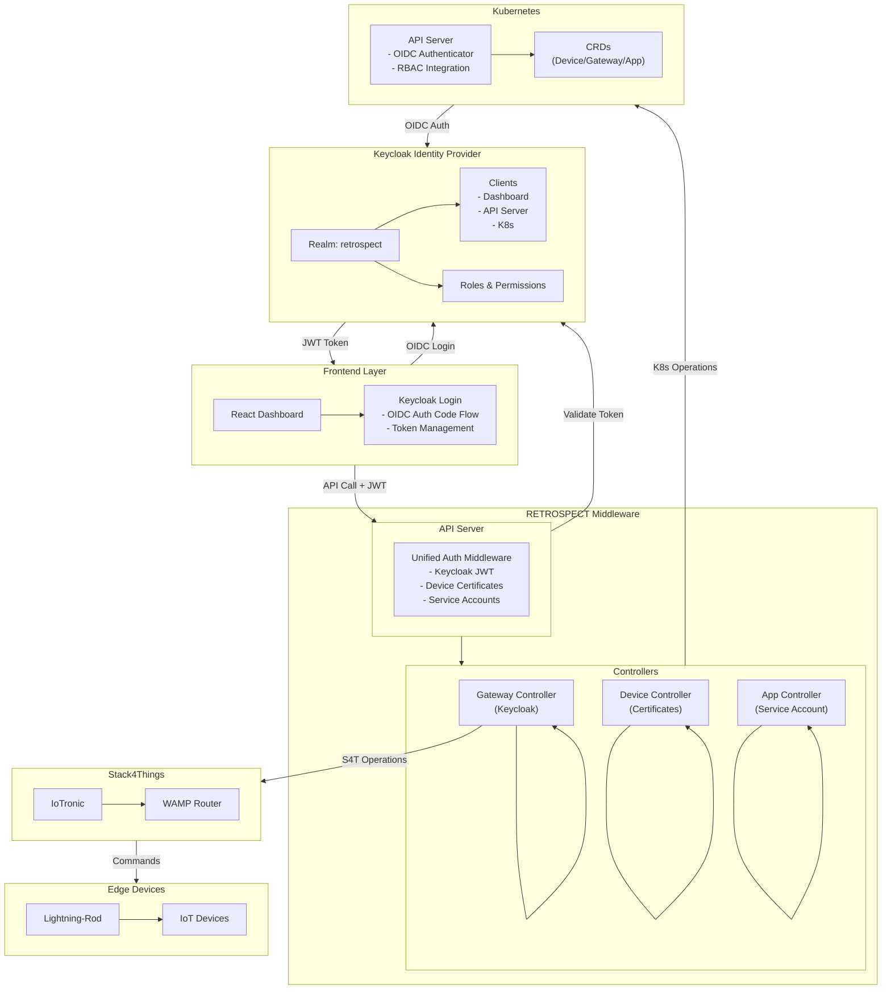
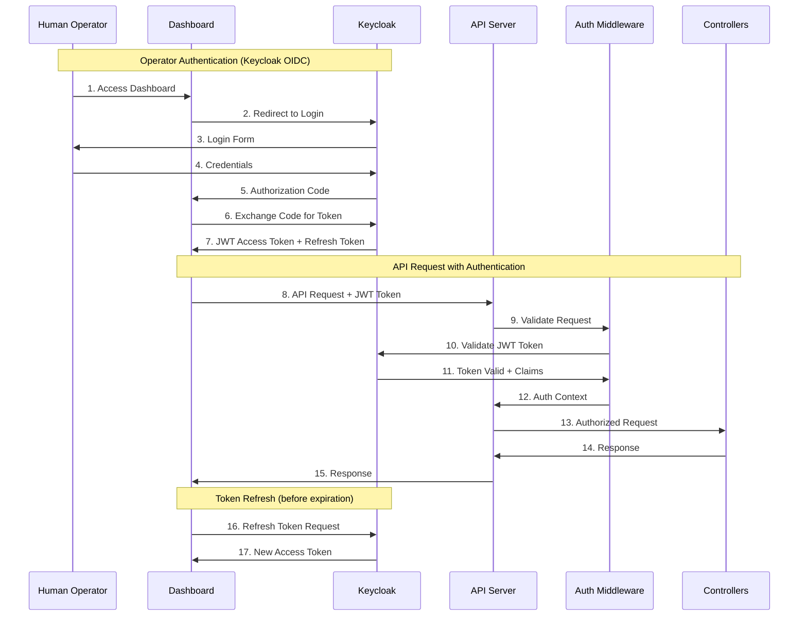
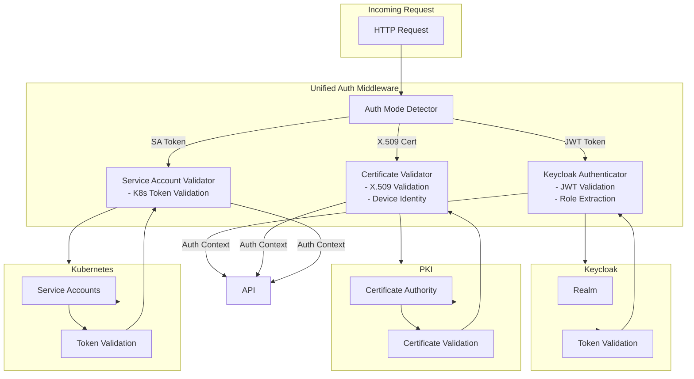
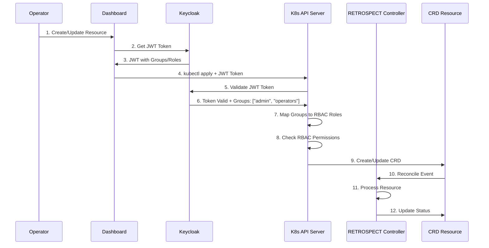
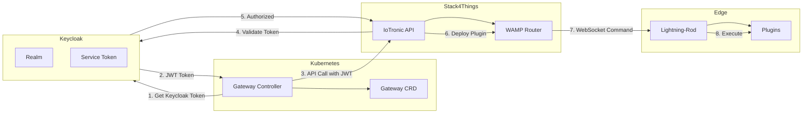

# Project 2: Keycloak Integration in RETROSPECT Middleware

## General Information

**Title:** Keycloak Integration in RETROSPECT Middleware: Unified Identity and Access Management for IoT Orchestration

**Level:** Advanced (Master's Thesis)

**Estimated Duration:** 4-6 months

**Required Skills:** Rust, Kubernetes, Keycloak, OIDC/OAuth2, TLS/mTLS, RBAC

---

## Context and Motivation

According to Deliverable D3.1, RETROSPECT currently uses:
- **X.509 certificates** for device authentication (mTLS)
- **Kubernetes service account tokens** for internal services
- **OIDC mentioned** but not implemented for human operators
- **RBAC** for authorization

**Current Limitations:**
- No centralized Identity Provider for human operators
- No SSO between dashboard and API
- Difficult integration with external Identity Providers
- Limited authorization beyond basic RBAC

**Objective:** Integrate Keycloak as centralized Identity Provider for human operators, maintaining existing certificate-based authentication for devices and service account tokens for internal services.

---

## Project Objectives

### Main Objective
Integrate Keycloak into RETROSPECT middleware to provide unified authentication and authorization for human operators, while maintaining existing mechanisms for devices and internal services.

### Specific Objectives
1. Configure Keycloak as Identity Provider for RETROSPECT
2. Implement OIDC authentication for operators in dashboard
3. Integrate Keycloak with Kubernetes RBAC for authorization
4. Implement multi-mode authentication middleware (Keycloak + certificates + service accounts)
5. Extend Gateway Controller for Keycloak authentication
6. Implement automatic token refresh
7. Provide SSO between dashboard and API

---

## Technical Description

### 1. Keycloak Configuration for RETROSPECT

**Activities:**
- Setup dedicated Keycloak realm for RETROSPECT
- Client configuration:
  - Dashboard UI (public client)
  - API Server (confidential client)
  - Kubernetes API Server (OIDC integration)
- User management:
  - Operator accounts
  - Role definitions (admin, operator, viewer)
  - Group management for multi-tenant
- Service accounts for internal components (optional)

**Deliverable:** Keycloak realm configuration + documentation

---

### 2. Multi-Mode Authentication Middleware

**Components to implement:**

#### 2.1 Authentication Trait
```rust
// New crate: wasmbed-auth-keycloak
pub trait Authenticator {
    async fn authenticate(&self, request: &AuthRequest) -> Result<AuthResult, AuthError>;
    async fn validate_token(&self, token: &str) -> Result<TokenClaims, AuthError>;
    async fn refresh_token(&self, refresh_token: &str) -> Result<TokenPair, AuthError>;
}
```

#### 2.2 Multi-Mode Authentication Handler
```rust
pub enum AuthenticationMode {
    KeycloakOIDC { token: String },
    DeviceCertificate { cert: X509Certificate },
    ServiceAccount { token: String },
}

pub struct UnifiedAuthHandler {
    keycloak: KeycloakAuthenticator,
    cert_validator: CertificateValidator,
    service_account_validator: ServiceAccountValidator,
}

impl UnifiedAuthHandler {
    pub async fn authenticate(&self, mode: AuthenticationMode) -> Result<AuthContext>;
    pub fn determine_mode(&self, request: &Request) -> Option<AuthenticationMode>;
}
```

**Deliverable:** Authentication middleware with multi-mode support

---

### 3. Dashboard Integration

**Activities:**
- Integrate Keycloak login in React dashboard
- Implement OIDC Authorization Code flow
- Token management in frontend:
  - Secure token storage
  - Automatic token refresh
  - Token expiration handling
- Logout and session cleanup
- Protected routes with authentication checks

**React Components:**
```typescript
// Keycloak context provider
export const KeycloakProvider: React.FC = ({ children }) => {
  const keycloak = useKeycloak();
  // Token management, refresh logic
};

// Protected route wrapper
export const ProtectedRoute: React.FC<RouteProps> = ({ ... }) => {
  const { authenticated } = useAuth();
  // Route protection logic
};
```

**Deliverable:** Modified dashboard with integrated Keycloak login

---

### 4. API Server Authentication

**Activities:**
- Modify `wasmbed-api-server` to:
  - Accept JWT tokens from Keycloak
  - Validate tokens using Keycloak public key
  - Extract user claims and roles
  - Middleware for authentication checks
- Support multi-mode authentication:
  - Keycloak JWT for operators
  - X.509 certificates for devices (existing)
  - Service account tokens for internal services (existing)

**Middleware implementation:**
```rust
pub async fn auth_middleware(
    request: Request<Body>,
    next: Next<Body>,
) -> Result<Response, AuthError> {
    // Determine authentication mode
    // Validate token/certificate
    // Extract user context
    // Attach to request
}
```

**Deliverable:** API Server with multi-mode authentication middleware

---

### 5. Kubernetes RBAC Integration

**Activities:**
- Configure Kubernetes OIDC authenticator for Keycloak
- Mapping Keycloak roles → Kubernetes RBAC Roles
- Dynamic role assignment based on Keycloak groups
- Policy engine combining:
  - Keycloak permissions
  - Kubernetes RBAC policies
  - Device capabilities
- Audit logging of all authorization decisions

**Components:**
```yaml
# Kubernetes API Server OIDC configuration
apiVersion: v1
kind: ConfigMap
metadata:
  name: kube-apiserver-config
data:
  oidc-issuer-url: "https://keycloak.example.com/realms/retrospect"
  oidc-client-id: "retrospect-k8s"
  oidc-username-claim: "preferred_username"
  oidc-groups-claim: "groups"
```

**Deliverable:** Kubernetes RBAC integration with Keycloak

---

### 6. Gateway Controller Extension

**Activities:**
- Extend Gateway Controller to support Keycloak authentication
- Modify S4T client calls to use Keycloak tokens when needed
- Token management for Stack4Things operations
- Integration with IoTronic using Keycloak tokens

**Modifications to Gateway Controller:**
```rust
pub struct GatewayController {
    client: Client,
    keycloak_client: KeycloakClient, // New
    // ... existing fields
}

impl GatewayController {
    async fn reconcile_with_auth(&self, gateway: Gateway) -> Result<()> {
        // Get Keycloak token for S4T operations
        let token = self.keycloak_client.get_token().await?;
        // Use token for IoTronic API calls
    }
}
```

**Deliverable:** Extended Gateway Controller with Keycloak support

---

### 7. Device Controller Integration (Optional)

**Activities:**
- Integrate Keycloak for device identity management
- Linking device certificates with Keycloak device identities
- Enhanced authorization based on Keycloak device roles
- Coordinated revocation between CA and Keycloak

**Deliverable:** Device Controller integration with Keycloak (optional)

---

## Architecture

### System Architecture Diagram



### Multi-Mode Authentication Flow



### Multi-Mode Authentication Architecture



### Kubernetes RBAC Integration Flow



### Gateway Controller Integration with Stack4Things



---

## Technology Stack

- **Languages:** Rust (middleware), TypeScript/React (dashboard)
- **Frameworks:** Keycloak Admin API, OIDC/OAuth2 libraries
- **Protocols:** OIDC, OAuth2, JWT, TLS 1.3, mTLS
- **Infrastructure:** Kubernetes, Keycloak
- **Tooling:** kubectl, Helm, GitOps, Rust toolchain

---

## Expected Deliverables

### Code and Implementation
1. Multi-mode authentication middleware (Rust crate)
2. Dashboard with integrated Keycloak login
3. API Server with authentication middleware
4. Gateway Controller extension with Keycloak support
5. Kubernetes RBAC integration

### Documentation
1. Keycloak configuration guide for RETROSPECT
2. Authentication architecture documentation
3. API documentation with authentication endpoints
4. Dashboard user guide
5. Deployment guide with Keycloak setup

### Testing
1. Unit tests for authentication components
2. Integration tests: Dashboard → API → Controllers
3. End-to-end tests with complete scenario
4. Security tests (token validation, expiration, revocation)
5. Performance tests (token refresh, API latency)

### Use Case
1. Multi-operator deployment with SSO
2. Multi-tenant scenario with role-based access
3. Integration with external Identity Providers (Azure AD, Okta)

---

## Evaluation and Metrics

- **Functionality (40%):** Working authentication, SSO, multi-mode support
- **Code Quality (20%):** Test coverage, code review, Rust best practices
- **Documentation (15%):** Guides, API docs, architecture documentation
- **Testing (15%):** Unit, integration, e2e, security tests
- **Presentation (10%):** Demo, presentation of results

---

## Bibliography and References

- `RETROSPECT_Deliverable_D3_1_v2/main_final.tex` - Section "Authentication and Authorization"
- `retrospect/retrospect/docs/security/security-overview.md`
- `RETROSPECT_Deliverable_D3_1_v2/main_final.tex` - Section "Kubernetes and Stack4Things Integration"
- Keycloak documentation: https://www.keycloak.org/documentation
- Kubernetes OIDC authenticator: https://kubernetes.io/docs/reference/access-authn-authz/authentication/#openid-connect-tokens

---

## Timeline and Milestones

### Milestone 1 (Month 1): Analysis and Design
- Complete analysis of current authentication mechanisms
- Design Keycloak integration architecture
- Define multi-mode authentication strategy

### Milestone 2 (Month 2-3): Core Implementation
- Keycloak configuration
- Authentication middleware implementation
- Dashboard integration
- API Server modifications

### Milestone 3 (Month 4): Controller Integration
- Gateway Controller extension
- Kubernetes RBAC integration
- Token management implementation

### Milestone 4 (Month 5-6): Testing and Documentation
- Complete testing suite
- Documentation
- Performance optimization
- Final validation

---

## Success Criteria

1. ✅ Keycloak successfully configured and integrated
2. ✅ Operators can authenticate via Keycloak in dashboard
3. ✅ Multi-mode authentication works (Keycloak + certificates + service accounts)
4. ✅ SSO works between dashboard and API
5. ✅ Kubernetes RBAC integration functional
6. ✅ Gateway Controller uses Keycloak tokens for S4T operations
7. ✅ All tests pass (unit, integration, e2e, security)
8. ✅ Performance is acceptable (<50ms overhead for authentication)
9. ✅ Documentation is complete and accurate

---

## Notes

This project focuses on integrating Keycloak throughout the RETROSPECT middleware stack, providing unified identity and access management while maintaining existing security mechanisms for devices and internal services.

