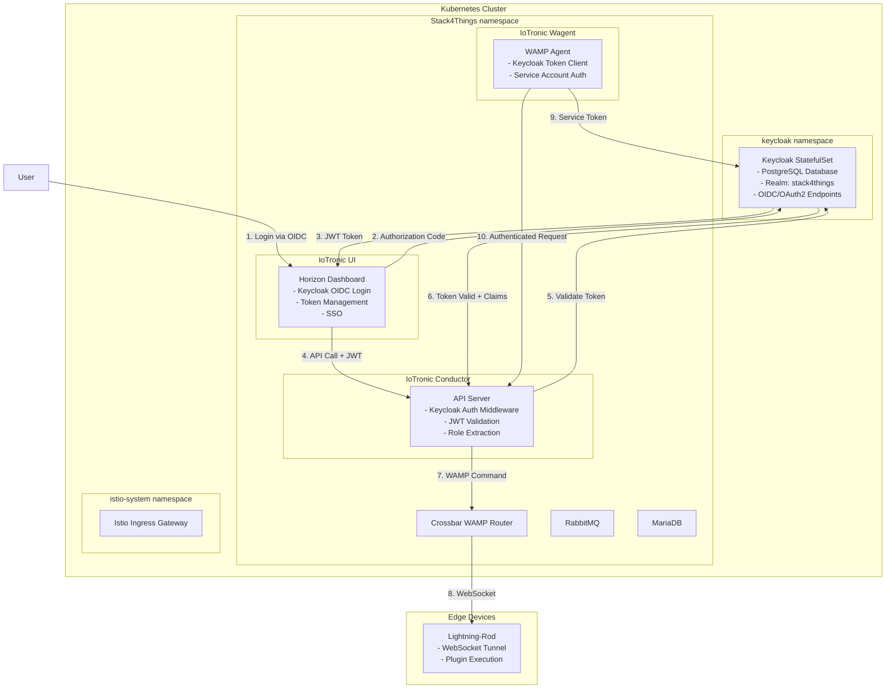
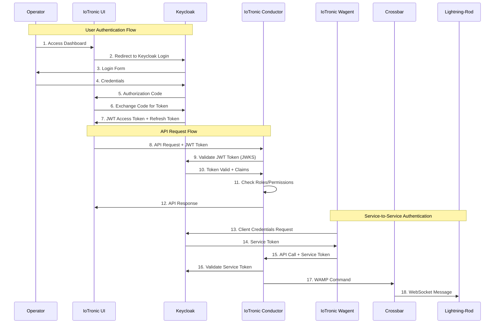
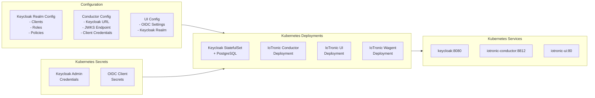

# Project 2: Keycloak Integration in Stack4Things Kubernetes Deployment

## General Information

**Title:** Keycloak Integration in Stack4Things Kubernetes Deployment: Migration from Keystone to Keycloak for Modern Identity and Access Management

**Required Skills:** Kubernetes, Keycloak, OIDC/OAuth2, Python, Helm, Istio, Docker/Container Technologies

---

## Context and Motivation

Stack4Things is an open-source framework designed to address the complexities of IoT fleet management, providing a comprehensive solution for orchestrating IoT devices, managing plugins, and facilitating communication between edge devices and cloud services. The framework consists of multiple components including IoTronic Conductor (the cloud-side orchestrator), Lightning-Rod (device-side agent), Crossbar (WAMP router), and a web-based UI built on OpenStack Horizon.

Currently, Stack4Things relies on OpenStack Keystone as its Identity Provider, which presents several architectural and operational challenges. Keystone, while powerful within the OpenStack ecosystem, creates tight coupling with OpenStack-specific infrastructure and introduces complexity that may not be necessary for IoT orchestration scenarios. The current deployment on Kubernetes (as documented in the `Stack4Things_k3s_deployment` repository) includes Keystone as a containerized service, but this approach limits flexibility in authentication methods and makes it difficult to integrate with modern identity management solutions.

The migration to Keycloak represents a strategic shift towards a more flexible, standards-based authentication architecture. Keycloak provides comprehensive support for OIDC and OAuth2 protocols, enabling seamless integration with external identity providers, support for modern authentication flows, and improved security features such as token introspection, fine-grained authorization policies, and centralized user management. This migration will not only modernize the authentication layer but also enable better integration with enterprise identity systems, support for multi-tenant scenarios, and improved user experience through Single Sign-On (SSO) capabilities.

The project involves analyzing the current Kubernetes deployment architecture, understanding how Keystone is integrated with IoTronic components, and systematically replacing Keystone authentication with Keycloak while maintaining backward compatibility during the transition period. This work requires deep understanding of Kubernetes deployment patterns, authentication middleware, and the internal architecture of Stack4Things components.

**Objective:** Replace Keystone with Keycloak as the Identity Provider in the Stack4Things Kubernetes deployment, implementing OIDC/OAuth2 authentication for all Stack4Things components while maintaining full functionality and improving security posture.

---

## Project Objectives

### Main Objective
Migrate the Stack4Things Kubernetes deployment from Keystone to Keycloak authentication, implementing a modern, standards-based identity and access management solution that maintains compatibility with existing Stack4Things functionality while enabling enhanced security features and integration capabilities.

### Specific Objectives
1. Analyze the current Stack4Things Kubernetes deployment architecture and Keystone integration points
2. Deploy and configure Keycloak as Identity Provider within the Kubernetes cluster
3. Implement OIDC/OAuth2 authentication middleware for IoTronic Conductor API
4. Modify IoTronic UI (Horizon-based) to use Keycloak for user authentication
5. Update IoTronic Wagent and other components to authenticate with Keycloak
6. Implement token validation and refresh mechanisms across all components
7. Configure Keycloak realm, clients, roles, and authorization policies for Stack4Things
8. Ensure seamless migration path with backward compatibility during transition
9. Document the migration process and provide deployment guides

---

## Technical Description

### 1. Analysis of Current Stack4Things Kubernetes Deployment

The first phase of the project involves a comprehensive analysis of the existing Stack4Things deployment. The `Stack4Things_k3s_deployment` repository contains the complete Kubernetes manifests for deploying Stack4Things, including deployments for Keystone, IoTronic Conductor, IoTronic UI, IoTronic Wagent, Crossbar, RabbitMQ, and MariaDB. Understanding how these components interact and how Keystone authentication is currently implemented is crucial for planning the migration.

Students will need to examine the deployment manifests, configuration files, and environment variables to identify all Keystone integration points. This includes analyzing how IoTronic Conductor validates tokens, how the UI authenticates users, how service-to-service authentication works, and how roles and permissions are managed. The analysis should result in a detailed mapping document that identifies every component, configuration file, and code path that interacts with Keystone.

Particular attention should be paid to the configuration files in `conf_conductor/`, `conf_ui/`, and `conf_wagent/` directories, as these contain the authentication settings that need to be modified. Additionally, the environment variables in the deployment manifests show how Keystone endpoints and credentials are passed to containers, which will need to be replaced with Keycloak configuration.

### 2. Keycloak Deployment and Configuration in Kubernetes

Deploying Keycloak within the Kubernetes cluster requires careful planning to ensure high availability, proper resource allocation, and secure configuration. Keycloak should be deployed as a StatefulSet with persistent storage for its database (PostgreSQL or MySQL), ensuring that user data and realm configurations persist across pod restarts.

The Keycloak configuration must include a dedicated realm for Stack4Things with appropriate client applications configured for each component. The IoTronic Conductor will require a confidential client for service-to-service authentication using client credentials flow. The IoTronic UI will need a public client configured for authorization code flow with PKCE to support user login. Other components like IoTronic Wagent may require service accounts or specific client configurations based on their authentication needs.

Roles and permissions must be carefully mapped from the existing Keystone roles (admin_iot_project, manager_iot_project, user_iot) to Keycloak roles, ensuring that authorization policies are equivalent or improved. The configuration should also support user federation if needed, and provide proper token settings including expiration times, refresh token rotation, and session management.

### 3. IoTronic Conductor Authentication Middleware Implementation

The IoTronic Conductor is the core API server that handles all Stack4Things operations. Currently, it authenticates requests using Keystone tokens passed via the `X-Auth-Token` header. This needs to be replaced with Keycloak JWT token validation.

The implementation requires creating a Python middleware that intercepts incoming API requests, extracts JWT tokens from the `Authorization: Bearer <token>` header, validates the token signature using Keycloak's public key (obtained via JWKS endpoint), checks token expiration, and extracts user claims and roles. The middleware should also handle token refresh scenarios and provide proper error responses for authentication failures.

The middleware must integrate seamlessly with the existing IoTronic Conductor codebase, which is based on Flask or similar Python web framework. Careful attention should be paid to maintaining backward compatibility during the migration period, potentially supporting both Keystone and Keycloak tokens for a transition period.

### 4. IoTronic UI (Horizon) Keycloak Integration

The IoTronic UI is built on OpenStack Horizon, which natively integrates with Keystone. Integrating Keycloak requires modifying the Horizon configuration to use OIDC authentication instead of Keystone. This involves configuring Horizon's authentication backend to use Keycloak's OIDC provider, implementing the authorization code flow for user login, and handling token refresh and session management.

The UI configuration files in `conf_ui/` directory contain the Horizon settings that need to be modified. The integration should provide a seamless user experience with proper redirect handling, session management, and logout functionality. Additionally, user role mapping from Keycloak to Horizon's permission system must be implemented to ensure that UI features are properly restricted based on user roles.

### 5. Component Configuration Updates

All Stack4Things components that currently authenticate with Keystone need to be updated to use Keycloak. This includes updating environment variables in deployment manifests, modifying configuration files, and ensuring that service-to-service communication uses Keycloak tokens.

The IoTronic Wagent component, which communicates with IoTronic Conductor, needs to be configured to obtain and use Keycloak tokens. This may involve implementing a token acquisition mechanism using client credentials flow, storing tokens securely, and refreshing them before expiration.

Crossbar and other components may also require authentication updates depending on their current implementation. Each component should be analyzed individually to determine the extent of changes required.

### 6. Migration Strategy and Backward Compatibility

A critical aspect of this project is ensuring a smooth migration path that doesn't disrupt existing deployments. The migration strategy should include a dual-mode authentication period where both Keystone and Keycloak tokens are accepted, allowing gradual migration of users and services.

This requires implementing a token translation layer or adapter that can validate tokens from both systems, potentially translating Keystone tokens to Keycloak tokens or implementing a unified authentication interface that supports both providers. The strategy should also include rollback procedures and clear migration steps documented for operators.

### 7. Testing and Validation

Comprehensive testing must be performed to ensure that all Stack4Things functionality works correctly with Keycloak authentication. This includes testing API endpoints, UI workflows, plugin deployment, device management, and all other Stack4Things features. Performance testing should verify that authentication overhead is acceptable, and security testing should validate token validation, expiration handling, and authorization enforcement.

---

## Architecture

### System Architecture Diagram

### Authentication Flow Diagram

### Kubernetes Deployment Architecture

---

## Technology Stack

- **Container Orchestration:** Kubernetes (K3s), Helm
- **Identity Provider:** Keycloak
- **Service Mesh:** Istio (for ingress and traffic management)
- **Load Balancer:** MetalLB
- **Programming Languages:** Python (IoTronic components), JavaScript (UI)
- **Protocols:** OIDC, OAuth2, JWT, WAMP, WebSocket
- **Database:** PostgreSQL (for Keycloak), MariaDB (for Stack4Things)
- **Message Broker:** RabbitMQ
- **Container Technologies:** Docker, Container images

---

## Expected Deliverables

### Code and Implementation
1. Modified Kubernetes deployment manifests with Keycloak integration
2. Keycloak deployment configuration (Helm charts or manifests)
3. Authentication middleware for IoTronic Conductor
4. Modified Horizon configuration for Keycloak OIDC
5. Updated configuration files for all Stack4Things components
6. Migration scripts and tooling

### Documentation
1. Analysis document of current Keystone integration
2. Keycloak realm configuration guide
3. Deployment guide for Keycloak-enabled Stack4Things
4. Migration guide from Keystone to Keycloak
5. API documentation updates
6. Troubleshooting guide

### Testing
1. Unit tests for authentication middleware
2. Integration tests for Keycloak authentication flows
3. End-to-end tests with complete Stack4Things scenarios
4. Security tests (token validation, expiration, revocation)
5. Performance tests (authentication overhead, token refresh)
6. Migration validation tests

### Use Case
1. Multi-operator deployment with role-based access
2. Integration with external Identity Providers (LDAP, Active Directory)
3. Multi-tenant Stack4Things deployment

---

## Bibliography and References

### Stack4Things Kubernetes Deployment
- Stack4Things Kubernetes Deployment Repository: https://github.com/MDSLab/Stack4Things_k3s_deployment.git
- Stack4Things GitHub: https://github.com/MDSLab/Stack4Things
- Stack4Things IoTronic API: https://github.com/MDSLab/iotronic
- Lightning-Rod Documentation: https://github.com/MDSLab/iotronic-lightningrod

### Related Stack4Things Integration Repositories
- **Stack4Things SDK for Go** (`https://github.com/MIKE9708/s4t-sdk-go.git`): 
  - Go SDK for Stack4Things API interactions
  - May be useful as reference for understanding API authentication patterns
- **Crossplane Provider for Stack4Things** (`https://github.com/MIKE9708/Provider4_S4T.git`):
  - Crossplane Provider implementation for Stack4Things
  - Useful reference for understanding Stack4Things API integration patterns

### Keycloak Documentation
- Keycloak Official Documentation: https://www.keycloak.org/documentation
- Keycloak Server Administration Guide: https://www.keycloak.org/docs/latest/server_admin/
- Keycloak Authorization Services: https://www.keycloak.org/docs/latest/authorization_services/
- Keycloak Admin REST API: https://www.keycloak.org/docs-api/latest/rest-api/
- Keycloak JavaScript Adapter: https://www.keycloak.org/docs/latest/securing_apps/#_javascript_adapter
- Keycloak OIDC/OAuth2 Configuration: https://www.keycloak.org/docs/latest/securing_apps/
- Keycloak Service Account Configuration: https://www.keycloak.org/docs/latest/server_admin/#service-accounts

### OIDC/OAuth2 Standards and Protocols
- RFC 6749 - OAuth 2.0 Authorization Framework: https://datatracker.ietf.org/doc/html/rfc6749
- RFC 6750 - OAuth 2.0 Bearer Token Usage: https://datatracker.ietf.org/doc/html/rfc6750
- RFC 7519 - JSON Web Token (JWT): https://datatracker.ietf.org/doc/html/rfc7519
- RFC 7517 - JSON Web Key (JWK): https://datatracker.ietf.org/doc/html/rfc7517
- OpenID Connect Core 1.0: https://openid.net/specs/openid-connect-core-1_0.html
- OpenID Connect Discovery 1.0: https://openid.net/specs/openid-connect-discovery-1_0.html
- OAuth 2.0 Token Introspection (RFC 7662): https://datatracker.ietf.org/doc/html/rfc7662
- OAuth 2.0 Device Flow (RFC 8628): https://datatracker.ietf.org/doc/html/rfc8628

### Kubernetes Documentation
- Kubernetes Custom Resource Definitions: https://kubernetes.io/docs/concepts/extend-kubernetes/api-extension/custom-resources/
- Kubernetes Controller Pattern: https://kubernetes.io/docs/concepts/architecture/controller/
- Kubernetes API Server OIDC Authenticator: https://kubernetes.io/docs/reference/access-authn-authz/authentication/#openid-connect-tokens
- Kubernetes RBAC Authorization: https://kubernetes.io/docs/reference/access-authn-authz/rbac/
- Kubernetes Service Accounts: https://kubernetes.io/docs/concepts/security/service-accounts/
- Kubernetes StatefulSets: https://kubernetes.io/docs/concepts/workloads/controllers/statefulset/

### Kubernetes Deployment Tools
- Helm Documentation: https://helm.sh/docs/
- K3s Documentation: https://docs.k3s.io/
- Istio Documentation: https://istio.io/latest/docs/
- MetalLB Documentation: https://metallb.universe.tf/

### Python Libraries
- Python Requests Library: https://docs.python-requests.org/
- Python JWT Library: https://pyjwt.readthedocs.io/
- Python Keycloak Admin Client: https://python-keycloak.readthedocs.io/
- Flask/WSGI Middleware: https://flask.palletsprojects.com/

### Additional Resources
- WebSocket Protocol (RFC 6455): https://datatracker.ietf.org/doc/html/rfc6455
- WAMP Protocol Documentation: https://wamp-proto.org/
- OpenStack Horizon Documentation: https://docs.openstack.org/horizon/
- OpenStack Keystone Documentation: https://docs.openstack.org/keystone/ (for understanding current implementation)

---

## Notes

This project focuses on migrating Stack4Things from Keystone to Keycloak authentication within a Kubernetes deployment context. The work involves deep understanding of Kubernetes deployment patterns, OIDC/OAuth2 protocols, and Stack4Things architecture. Students will gain hands-on experience with modern identity management, Kubernetes operations, and microservices authentication patterns.
