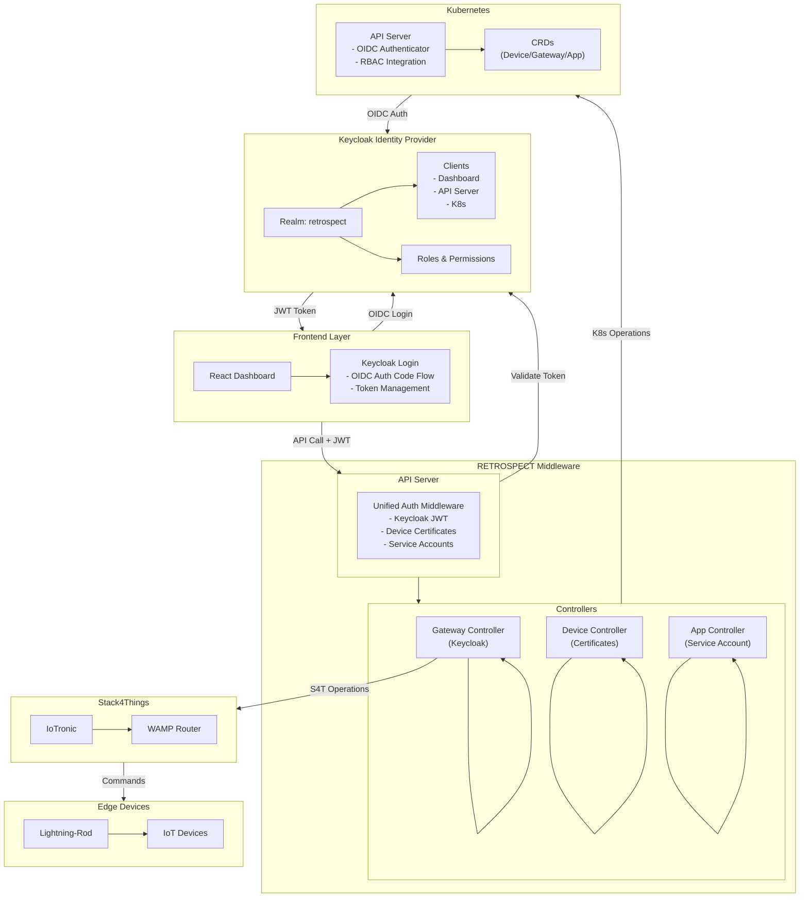
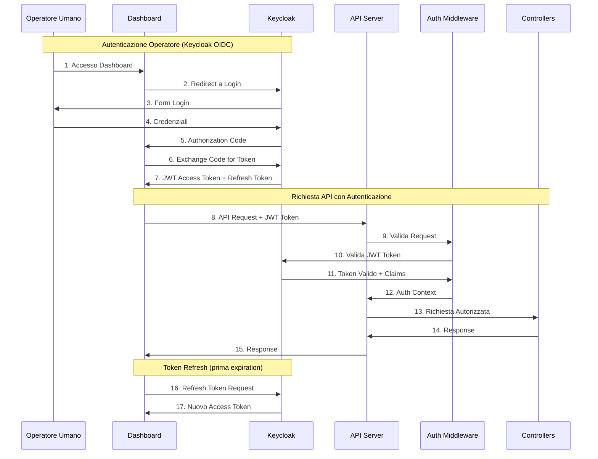
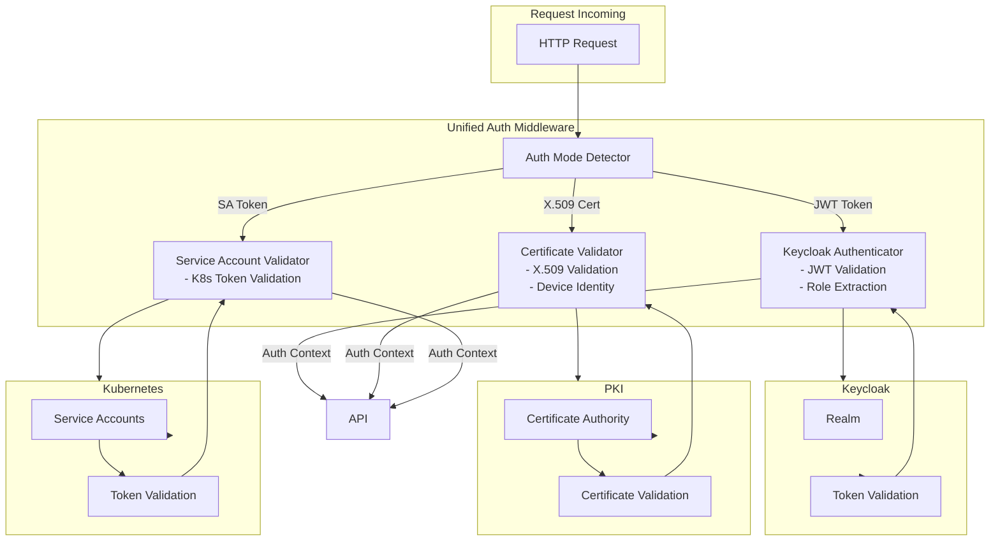
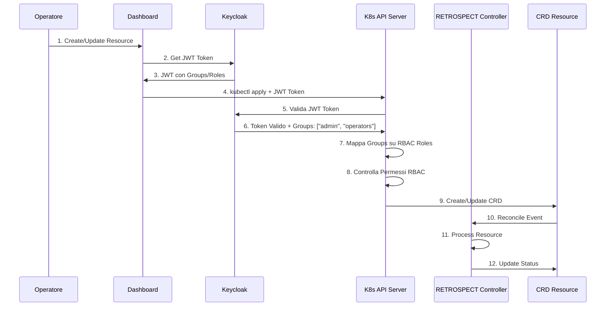
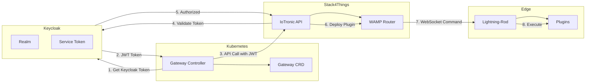

# Progetto 2: Integrazione Keycloak nel Middleware RETROSPECT

## Informazioni Generali

**Titolo:** Integrazione Keycloak nel Middleware RETROSPECT: Unified Identity and Access Management per Orchestrazione IoT

**Livello:** Avanzato (Tesi Magistrale)

**Durata Stimata:** 4-6 mesi

**Competenze Richieste:** Rust, Kubernetes, Keycloak, OIDC/OAuth2, TLS/mTLS, RBAC

---

## Contesto e Motivazione

Dal Deliverable D3.1, RETROSPECT attualmente utilizza:
- **Certificati X.509** per autenticazione device (mTLS)
- **Token service account Kubernetes** per servizi interni
- **OIDC menzionato** ma non implementato per operatori umani
- **RBAC** per autorizzazione

**Limitazioni Attuali:**
- Nessun Identity Provider centralizzato per operatori umani
- Nessun SSO tra dashboard e API
- Difficile integrazione con Identity Provider esterni
- Autorizzazione limitata oltre RBAC base

**Obiettivo:** Integrare Keycloak come Identity Provider centralizzato per operatori umani, mantenendo l'autenticazione basata su certificati esistente per i device e i token service account per i servizi interni.

---

## Obiettivi del Progetto

### Obiettivo Principale
Integrare Keycloak nel middleware RETROSPECT per fornire autenticazione e autorizzazione unificata per operatori umani, mantenendo i meccanismi esistenti per device e servizi interni.

### Obiettivi Specifici
1. Configurare Keycloak come Identity Provider per RETROSPECT
2. Implementare autenticazione OIDC per operatori nel dashboard
3. Integrare Keycloak con Kubernetes RBAC per autorizzazione
4. Implementare middleware di autenticazione multi-mode (Keycloak + certificati + service accounts)
5. Estendere Gateway Controller per autenticazione Keycloak
6. Implementare refresh automatico token
7. Fornire SSO tra dashboard e API

---

## Descrizione Tecnica

### 1. Configurazione Keycloak per RETROSPECT

**Attività:**
- Setup realm Keycloak dedicato per RETROSPECT
- Configurazione client:
  - Dashboard UI (public client)
  - API Server (confidential client)
  - Kubernetes API Server (integrazione OIDC)
- Gestione utenti:
  - Account operatori
  - Definizione ruoli (admin, operator, viewer)
  - Gestione gruppi per multi-tenant
- Service accounts per componenti interni (opzionale)

**Deliverable:** Configurazione realm Keycloak + documentazione

---

### 2. Middleware di Autenticazione Multi-Mode

**Componenti da implementare:**

#### 2.1 Authentication Trait
```rust
// Nuovo crate: wasmbed-auth-keycloak
pub trait Authenticator {
    async fn authenticate(&self, request: &AuthRequest) -> Result<AuthResult, AuthError>;
    async fn validate_token(&self, token: &str) -> Result<TokenClaims, AuthError>;
    async fn refresh_token(&self, refresh_token: &str) -> Result<TokenPair, AuthError>;
}
```

#### 2.2 Multi-Mode Authentication Handler
```rust
pub enum AuthenticationMode {
    KeycloakOIDC { token: String },
    DeviceCertificate { cert: X509Certificate },
    ServiceAccount { token: String },
}

pub struct UnifiedAuthHandler {
    keycloak: KeycloakAuthenticator,
    cert_validator: CertificateValidator,
    service_account_validator: ServiceAccountValidator,
}

impl UnifiedAuthHandler {
    pub async fn authenticate(&self, mode: AuthenticationMode) -> Result<AuthContext>;
    pub fn determine_mode(&self, request: &Request) -> Option<AuthenticationMode>;
}
```

**Deliverable:** Middleware di autenticazione con supporto multi-mode

---

### 3. Integrazione Dashboard

**Attività:**
- Integrare login Keycloak nel dashboard React
- Implementare OIDC Authorization Code flow
- Gestione token nel frontend:
  - Storage sicuro token
  - Refresh automatico token
  - Gestione expiration token
- Logout e cleanup sessione
- Route protette con controlli autenticazione

**Componenti React:**
```typescript
// Keycloak context provider
export const KeycloakProvider: React.FC = ({ children }) => {
  const keycloak = useKeycloak();
  // Token management, refresh logic
};

// Protected route wrapper
export const ProtectedRoute: React.FC<RouteProps> = ({ ... }) => {
  const { authenticated } = useAuth();
  // Route protection logic
};
```

**Deliverable:** Dashboard modificato con login Keycloak integrato

---

### 4. Autenticazione API Server

**Attività:**
- Modificare `wasmbed-api-server` per:
  - Accettare token JWT da Keycloak
  - Validare token usando chiave pubblica Keycloak
  - Estrarre user claims e ruoli
  - Middleware per controlli autenticazione
- Supportare autenticazione multi-mode:
  - JWT Keycloak per operatori
  - Certificati X.509 per device (esistente)
  - Token service account per servizi interni (esistente)

**Implementazione middleware:**
```rust
pub async fn auth_middleware(
    request: Request<Body>,
    next: Next<Body>,
) -> Result<Response, AuthError> {
    // Determinare modalità autenticazione
    // Validare token/certificato
    // Estrarre contesto utente
    // Allegare a request
}
```

**Deliverable:** API Server con middleware autenticazione multi-mode

---

### 5. Integrazione Kubernetes RBAC

**Attività:**
- Configurare OIDC authenticator Kubernetes per Keycloak
- Mapping ruoli Keycloak → Kubernetes RBAC Roles
- Assegnazione ruoli dinamica basata su gruppi Keycloak
- Policy engine che combina:
  - Permessi Keycloak
  - Politiche Kubernetes RBAC
  - Capabilities device
- Audit logging di tutte le decisioni di autorizzazione

**Componenti:**
```yaml
# Configurazione Kubernetes API Server OIDC
apiVersion: v1
kind: ConfigMap
metadata:
  name: kube-apiserver-config
data:
  oidc-issuer-url: "https://keycloak.example.com/realms/retrospect"
  oidc-client-id: "retrospect-k8s"
  oidc-username-claim: "preferred_username"
  oidc-groups-claim: "groups"
```

**Deliverable:** Integrazione Kubernetes RBAC con Keycloak

---

### 6. Estensione Gateway Controller

**Attività:**
- Estendere Gateway Controller per supportare autenticazione Keycloak
- Modificare chiamate client S4T per usare token Keycloak quando necessario
- Gestione token per operazioni Stack4Things
- Integrazione con IoTronic usando token Keycloak

**Modifiche a Gateway Controller:**
```rust
pub struct GatewayController {
    client: Client,
    keycloak_client: KeycloakClient, // Nuovo
    // ... campi esistenti
}

impl GatewayController {
    async fn reconcile_with_auth(&self, gateway: Gateway) -> Result<()> {
        // Ottenere token Keycloak per operazioni S4T
        let token = self.keycloak_client.get_token().await?;
        // Usare token per chiamate API IoTronic
    }
}
```

**Deliverable:** Gateway Controller esteso con supporto Keycloak

---

### 7. Integrazione Device Controller (Opzionale)

**Attività:**
- Integrare Keycloak per gestione identità device
- Linking certificati device con identità Keycloak device
- Autorizzazione avanzata basata su ruoli Keycloak device
- Revoca coordinata tra CA e Keycloak

**Deliverable:** Integrazione Device Controller con Keycloak (opzionale)

---

## Architettura

### Diagramma Architettura Sistema



### Diagramma Flusso Autenticazione Multi-Mode



### Architettura Autenticazione Multi-Mode



### Flusso Integrazione Kubernetes RBAC



### Integrazione Gateway Controller con Stack4Things



---

## Stack Tecnologico

- **Linguaggi:** Rust (middleware), TypeScript/React (dashboard)
- **Framework:** Keycloak Admin API, librerie OIDC/OAuth2
- **Protocolli:** OIDC, OAuth2, JWT, TLS 1.3, mTLS
- **Infrastruttura:** Kubernetes, Keycloak
- **Tooling:** kubectl, Helm, GitOps, Rust toolchain

---

## Deliverable Attesi

### Codice e Implementazione
1. Middleware autenticazione multi-mode (Rust crate)
2. Dashboard con login Keycloak integrato
3. API Server con middleware autenticazione
4. Estensione Gateway Controller con supporto Keycloak
5. Integrazione Kubernetes RBAC

### Documentazione
1. Guida configurazione Keycloak per RETROSPECT
2. Documentazione architettura autenticazione
3. Documentazione API con endpoint autenticazione
4. Guida utente dashboard
5. Guida deployment con setup Keycloak

### Testing
1. Unit test per componenti autenticazione
2. Test di integrazione: Dashboard → API → Controllers
3. Test end-to-end con scenario completo
4. Test di sicurezza (validazione token, expiration, revoca)
5. Test di performance (token refresh, latenza API)

### Use Case
1. Deployment multi-operatore con SSO
2. Scenario multi-tenant con accesso role-based
3. Integrazione con Identity Provider esterni (Azure AD, Okta)

---

## Valutazione e Metriche

- **Funzionalità (40%):** Autenticazione funzionante, SSO, supporto multi-mode
- **Qualità Codice (20%):** Test coverage, code review, Rust best practices
- **Documentazione (15%):** Guide, API docs, documentazione architettura
- **Testing (15%):** Unit, integration, e2e, security tests
- **Presentazione (10%):** Demo, presentazione risultati

---

## Bibliografia e Riferimenti

- `RETROSPECT_Deliverable_D3_1_v2/main_final.tex` - Sezione "Authentication and Authorization"
- `retrospect/retrospect/docs/security/security-overview.md`
- `RETROSPECT_Deliverable_D3_1_v2/main_final.tex` - Sezione "Kubernetes and Stack4Things Integration"
- Documentazione Keycloak: https://www.keycloak.org/documentation
- Kubernetes OIDC authenticator: https://kubernetes.io/docs/reference/access-authn-authz/authentication/#openid-connect-tokens

---

## Timeline e Milestone

### Milestone 1 (Mese 1): Analisi e Design
- Completare analisi meccanismi autenticazione attuali
- Design architettura integrazione Keycloak
- Definire strategia autenticazione multi-mode

### Milestone 2 (Mese 2-3): Implementazione Core
- Configurazione Keycloak
- Implementazione middleware autenticazione
- Integrazione dashboard
- Modifiche API Server

### Milestone 3 (Mese 4): Integrazione Controllers
- Estensione Gateway Controller
- Integrazione Kubernetes RBAC
- Implementazione gestione token

### Milestone 4 (Mese 5-6): Testing e Documentazione
- Suite di test completa
- Documentazione
- Ottimizzazione performance
- Validazione finale

---

## Criteri di Successo

1. ✅ Keycloak configurato e integrato con successo
2. ✅ Gli operatori possono autenticarsi via Keycloak nel dashboard
3. ✅ Autenticazione multi-mode funziona (Keycloak + certificati + service accounts)
4. ✅ SSO funziona tra dashboard e API
5. ✅ Integrazione Kubernetes RBAC funzionale
6. ✅ Gateway Controller usa token Keycloak per operazioni S4T
7. ✅ Tutti i test passano (unit, integration, e2e, security)
8. ✅ Performance è accettabile (<50ms overhead per autenticazione)
9. ✅ Documentazione è completa e accurata

---

## Note

Questo progetto si concentra sull'integrazione di Keycloak in tutto lo stack middleware RETROSPECT, fornendo unified identity and access management mantenendo i meccanismi di sicurezza esistenti per device e servizi interni.

