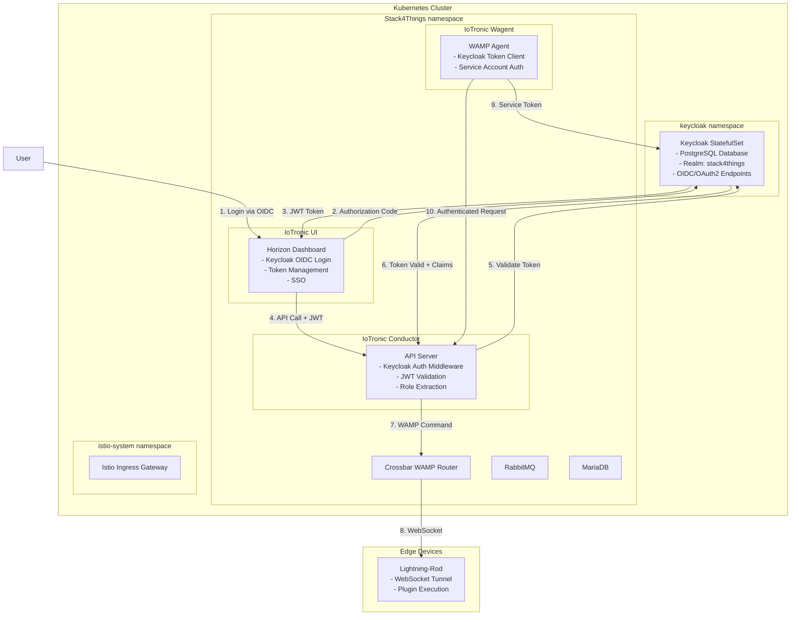
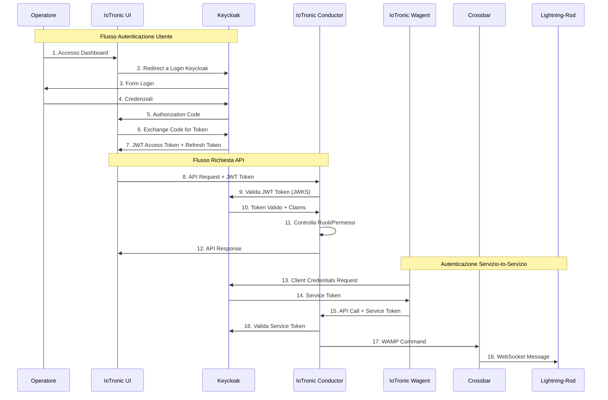
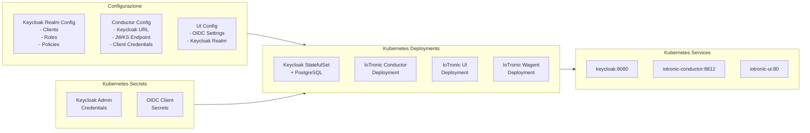

# Progetto 2: Integrazione Keycloak nel Deployment Kubernetes di Stack4Things

## Informazioni Generali

**Titolo:** Integrazione Keycloak nel Deployment Kubernetes di Stack4Things: Migrazione da Keystone a Keycloak per Identity and Access Management Moderno

**Competenze Richieste:** Kubernetes, Keycloak, OIDC/OAuth2, Python, Helm, Istio, Docker/Container Technologies

---

## Contesto e Motivazione

Stack4Things è un framework open-source progettato per gestire la complessità della gestione di flotte IoT, fornendo una soluzione completa per orchestrare dispositivi IoT, gestire plugin e facilitare la comunicazione tra dispositivi edge e servizi cloud. Il framework è composto da diversi componenti tra cui IoTronic Conductor (l'orchestratore lato cloud), Lightning-Rod (l'agente lato dispositivo), Crossbar (router WAMP), e un'interfaccia web basata su OpenStack Horizon.

Attualmente, Stack4Things si basa su OpenStack Keystone come Identity Provider, il che presenta diverse sfide architetturali e operative. Keystone, sebbene potente nell'ecosistema OpenStack, crea un accoppiamento stretto con l'infrastruttura specifica di OpenStack e introduce complessità che potrebbe non essere necessaria per scenari di orchestrazione IoT. Il deployment attuale su Kubernetes (come documentato nel repository `Stack4Things_k3s_deployment`) include Keystone come servizio containerizzato, ma questo approccio limita la flessibilità nei metodi di autenticazione e rende difficile l'integrazione con soluzioni moderne di gestione delle identità.

La migrazione a Keycloak rappresenta un cambiamento strategico verso un'architettura di autenticazione più flessibile e basata su standard. Keycloak fornisce supporto completo per i protocolli OIDC e OAuth2, abilitando integrazione seamless con identity provider esterni, supporto per flussi di autenticazione moderni, e funzionalità di sicurezza migliorate come token introspection, policy di autorizzazione granulari, e gestione centralizzata degli utenti. Questa migrazione non solo modernizzerà il layer di autenticazione ma abiliterà anche una migliore integrazione con sistemi di identità enterprise, supporto per scenari multi-tenant, e miglioramento dell'esperienza utente attraverso capacità di Single Sign-On (SSO).

Il progetto coinvolge l'analisi dell'architettura di deployment Kubernetes attuale, comprendere come Keystone è integrato con i componenti IoTronic, e sostituire sistematicamente l'autenticazione Keystone con Keycloak mantenendo la compatibilità all'indietro durante il periodo di transizione. Questo lavoro richiede una comprensione approfondita dei pattern di deployment Kubernetes, middleware di autenticazione, e l'architettura interna dei componenti Stack4Things.

**Obiettivo:** Sostituire Keystone con Keycloak come Identity Provider nel deployment Kubernetes di Stack4Things, implementando autenticazione OIDC/OAuth2 per tutti i componenti Stack4Things mantenendo la piena funzionalità e migliorando la postura di sicurezza.

---

## Obiettivi del Progetto

### Obiettivo Principale
Migrare il deployment Kubernetes di Stack4Things da autenticazione Keystone a Keycloak, implementando una soluzione moderna e basata su standard per identity and access management che mantiene la compatibilità con la funzionalità Stack4Things esistente abilitando al contempo funzionalità di sicurezza avanzate e capacità di integrazione.

### Obiettivi Specifici
1. Analizzare l'architettura del deployment Kubernetes Stack4Things attuale e i punti di integrazione Keystone
2. Deployare e configurare Keycloak come Identity Provider all'interno del cluster Kubernetes
3. Implementare middleware di autenticazione OIDC/OAuth2 per l'API IoTronic Conductor
4. Modificare IoTronic UI (basato su Horizon) per usare Keycloak per l'autenticazione utente
5. Aggiornare IoTronic Wagent e altri componenti per autenticarsi con Keycloak
6. Implementare meccanismi di validazione e refresh token tra tutti i componenti
7. Configurare realm Keycloak, client, ruoli e policy di autorizzazione per Stack4Things
8. Garantire un percorso di migrazione seamless con compatibilità all'indietro durante la transizione
9. Documentare il processo di migrazione e fornire guide di deployment

---

## Descrizione Tecnica

### 1. Analisi del Deployment Kubernetes Stack4Things Attuale

La prima fase del progetto coinvolge un'analisi comprensiva del deployment Stack4Things esistente. Il repository `Stack4Things_k3s_deployment` contiene i manifest Kubernetes completi per deployare Stack4Things, inclusi deployment per Keystone, IoTronic Conductor, IoTronic UI, IoTronic Wagent, Crossbar, RabbitMQ, e MariaDB. Comprendere come questi componenti interagiscono e come l'autenticazione Keystone è attualmente implementata è cruciale per pianificare la migrazione.

Gli studenti dovranno esaminare i manifest di deployment, i file di configurazione, e le variabili d'ambiente per identificare tutti i punti di integrazione Keystone. Questo include analizzare come IoTronic Conductor valida i token, come l'UI autentica gli utenti, come funziona l'autenticazione servizio-to-servizio, e come ruoli e permessi sono gestiti. L'analisi dovrebbe risultare in un documento di mapping dettagliato che identifica ogni componente, file di configurazione, e percorso di codice che interagisce con Keystone.

Particolare attenzione dovrebbe essere data ai file di configurazione nelle directory `conf_conductor/`, `conf_ui/`, e `conf_wagent/`, poiché questi contengono le impostazioni di autenticazione che devono essere modificate. Inoltre, le variabili d'ambiente nei manifest di deployment mostrano come gli endpoint Keystone e le credenziali sono passate ai container, che dovranno essere sostituite con configurazione Keycloak.

### 2. Deployment e Configurazione Keycloak in Kubernetes

Deployare Keycloak all'interno del cluster Kubernetes richiede pianificazione accurata per garantire alta disponibilità, allocazione appropriata delle risorse, e configurazione sicura. Keycloak dovrebbe essere deployato come StatefulSet con storage persistente per il suo database (PostgreSQL o MySQL), garantendo che i dati utente e le configurazioni realm persistano tra i riavvii dei pod.

La configurazione Keycloak deve includere un realm dedicato per Stack4Things con applicazioni client appropriate configurate per ogni componente. IoTronic Conductor richiederà un client confidenziale per autenticazione servizio-to-servizio usando client credentials flow. IoTronic UI avrà bisogno di un client pubblico configurato per authorization code flow con PKCE per supportare il login utente. Altri componenti come IoTronic Wagent potrebbero richiedere service account o configurazioni client specifiche basate sulle loro necessità di autenticazione.

Ruoli e permessi devono essere attentamente mappati dai ruoli Keystone esistenti (admin_iot_project, manager_iot_project, user_iot) a ruoli Keycloak, garantendo che le policy di autorizzazione siano equivalenti o migliorate. La configurazione dovrebbe anche supportare user federation se necessario, e fornire impostazioni token appropriate inclusi tempi di scadenza, rotazione refresh token, e gestione sessioni.

### 3. Implementazione Middleware Autenticazione IoTronic Conductor

IoTronic Conductor è il server API core che gestisce tutte le operazioni Stack4Things. Attualmente, autentica le richieste usando token Keystone passati via header `X-Auth-Token`. Questo deve essere sostituito con validazione token JWT Keycloak.

L'implementazione richiede creare un middleware Python che intercetta le richieste API in arrivo, estrae token JWT dall'header `Authorization: Bearer <token>`, valida la firma del token usando la chiave pubblica Keycloak (ottenuta via endpoint JWKS), controlla la scadenza del token, e estrae claim utente e ruoli. Il middleware dovrebbe anche gestire scenari di refresh token e fornire risposte di errore appropriate per fallimenti di autenticazione.

Il middleware deve integrarsi seamlessly con il codebase IoTronic Conductor esistente, che è basato su Flask o framework web Python simile. Attenzione attenta dovrebbe essere data al mantenere compatibilità all'indietro durante il periodo di migrazione, potenzialmente supportando sia token Keystone che Keycloak per un periodo di transizione.

### 4. Integrazione Keycloak IoTronic UI (Horizon)

IoTronic UI è costruito su OpenStack Horizon, che si integra nativamente con Keystone. Integrare Keycloak richiede modificare la configurazione Horizon per usare autenticazione OIDC invece di Keystone. Questo coinvolge configurare il backend di autenticazione Horizon per usare il provider OIDC Keycloak, implementare authorization code flow per il login utente, e gestire refresh token e gestione sessioni.

I file di configurazione UI nella directory `conf_ui/` contengono le impostazioni Horizon che devono essere modificate. L'integrazione dovrebbe fornire un'esperienza utente seamless con gestione redirect appropriata, gestione sessioni, e funzionalità logout. Inoltre, mappatura ruoli utente da Keycloak al sistema di permessi Horizon deve essere implementata per garantire che le funzionalità UI siano propriamente ristrette basate sui ruoli utente.

### 5. Aggiornamenti Configurazione Componenti

Tutti i componenti Stack4Things che attualmente si autenticano con Keystone devono essere aggiornati per usare Keycloak. Questo include aggiornare variabili d'ambiente nei manifest di deployment, modificare file di configurazione, e garantire che comunicazione servizio-to-servizio usi token Keycloak.

Il componente IoTronic Wagent, che comunica con IoTronic Conductor, deve essere configurato per ottenere e usare token Keycloak. Questo può coinvolgere implementare un meccanismo di acquisizione token usando client credentials flow, memorizzare token in modo sicuro, e refresharli prima della scadenza.

Crossbar e altri componenti possono anche richiedere aggiornamenti di autenticazione dipendentemente dalla loro implementazione attuale. Ogni componente dovrebbe essere analizzato individualmente per determinare l'estensione delle modifiche richieste.

### 6. Strategia Migrazione e Compatibilità All'indietro

Un aspetto critico di questo progetto è garantire un percorso di migrazione fluido che non interrompa deployment esistenti. La strategia di migrazione dovrebbe includere un periodo di autenticazione dual-mode dove sia token Keystone che Keycloak sono accettati, permettendo migrazione graduale di utenti e servizi.

Questo richiede implementare un layer di traduzione token o adapter che può validare token da entrambi i sistemi, potenzialmente traducendo token Keystone a token Keycloak o implementando un'interfaccia di autenticazione unificata che supporta entrambi i provider. La strategia dovrebbe anche includere procedure di rollback e passi di migrazione chiari documentati per operatori.

### 7. Testing e Validazione

Testing comprensivo deve essere eseguito per garantire che tutta la funzionalità Stack4Things funzioni correttamente con autenticazione Keycloak. Questo include testare endpoint API, workflow UI, deployment plugin, gestione dispositivi, e tutte le altre funzionalità Stack4Things. Testing di performance dovrebbe verificare che l'overhead di autenticazione sia accettabile, e testing di sicurezza dovrebbe validare validazione token, gestione scadenza, e enforcement autorizzazione.

---

## Architettura

### Diagramma Architettura Sistema

### Diagramma Flusso Autenticazione

### Architettura Deployment Kubernetes

---

## Stack Tecnologico

- **Container Orchestration:** Kubernetes (K3s), Helm
- **Identity Provider:** Keycloak
- **Service Mesh:** Istio (per ingress e traffic management)
- **Load Balancer:** MetalLB
- **Linguaggi di Programmazione:** Python (componenti IoTronic), JavaScript (UI)
- **Protocolli:** OIDC, OAuth2, JWT, WAMP, WebSocket
- **Database:** PostgreSQL (per Keycloak), MariaDB (per Stack4Things)
- **Message Broker:** RabbitMQ
- **Container Technologies:** Docker, Container images

---

## Deliverable Attesi

### Codice e Implementazione
1. Manifest deployment Kubernetes modificati con integrazione Keycloak
2. Configurazione deployment Keycloak (Helm charts o manifest)
3. Middleware autenticazione per IoTronic Conductor
4. Configurazione Horizon modificata per Keycloak OIDC
5. File di configurazione aggiornati per tutti i componenti Stack4Things
6. Script e tooling di migrazione

### Documentazione
1. Documento di analisi dell'integrazione Keystone attuale
2. Guida configurazione realm Keycloak
3. Guida deployment per Stack4Things abilitato Keycloak
4. Guida migrazione da Keystone a Keycloak
5. Aggiornamenti documentazione API
6. Guida troubleshooting

### Testing
1. Test unitari per middleware autenticazione
2. Test di integrazione per flussi autenticazione Keycloak
3. Test end-to-end con scenari Stack4Things completi
4. Test di sicurezza (validazione token, scadenza, revoca)
5. Test di performance (overhead autenticazione, refresh token)
6. Test di validazione migrazione

### Use Case
1. Deployment multi-operatore con accesso role-based
2. Integrazione con Identity Provider esterni (LDAP, Active Directory)
3. Deployment Stack4Things multi-tenant

---

## Bibliografia e Riferimenti

### Deployment Kubernetes Stack4Things
- Repository Deployment Kubernetes Stack4Things: https://github.com/MDSLab/Stack4Things_k3s_deployment.git
- Stack4Things GitHub: https://github.com/MDSLab/Stack4Things
- Stack4Things IoTronic API: https://github.com/MDSLab/iotronic
- Documentazione Lightning-Rod: https://github.com/MDSLab/iotronic-lightningrod

### Repository di Integrazione Stack4Things Correlati
- **Stack4Things SDK for Go** (`https://github.com/MIKE9708/s4t-sdk-go.git`): 
  - SDK Go per interazioni API Stack4Things
  - Può essere utile come riferimento per comprendere pattern di autenticazione API
- **Crossplane Provider per Stack4Things** (`https://github.com/MIKE9708/Provider4_S4T.git`):
  - Implementazione Crossplane Provider per Stack4Things
  - Utile riferimento per comprendere pattern di integrazione API Stack4Things

### Documentazione Keycloak
- Documentazione Ufficiale Keycloak: https://www.keycloak.org/documentation
- Guida Amministrazione Keycloak Server: https://www.keycloak.org/docs/latest/server_admin/
- Keycloak Authorization Services: https://www.keycloak.org/docs/latest/authorization_services/
- Keycloak Admin REST API: https://www.keycloak.org/docs-api/latest/rest-api/
- Keycloak JavaScript Adapter: https://www.keycloak.org/docs/latest/securing_apps/#_javascript_adapter
- Configurazione Keycloak OIDC/OAuth2: https://www.keycloak.org/docs/latest/securing_apps/
- Configurazione Keycloak Service Account: https://www.keycloak.org/docs/latest/server_admin/#service-accounts

### Standard e Protocolli OIDC/OAuth2
- RFC 6749 - OAuth 2.0 Authorization Framework: https://datatracker.ietf.org/doc/html/rfc6749
- RFC 6750 - OAuth 2.0 Bearer Token Usage: https://datatracker.ietf.org/doc/html/rfc6750
- RFC 7519 - JSON Web Token (JWT): https://datatracker.ietf.org/doc/html/rfc7519
- RFC 7517 - JSON Web Key (JWK): https://datatracker.ietf.org/doc/html/rfc7517
- OpenID Connect Core 1.0: https://openid.net/specs/openid-connect-core-1_0.html
- OpenID Connect Discovery 1.0: https://openid.net/specs/openid-connect-discovery-1_0.html
- OAuth 2.0 Token Introspection (RFC 7662): https://datatracker.ietf.org/doc/html/rfc7662
- OAuth 2.0 Device Flow (RFC 8628): https://datatracker.ietf.org/doc/html/rfc8628

### Documentazione Kubernetes
- Kubernetes Custom Resource Definitions: https://kubernetes.io/docs/concepts/extend-kubernetes/api-extension/custom-resources/
- Kubernetes Controller Pattern: https://kubernetes.io/docs/concepts/architecture/controller/
- Kubernetes API Server OIDC Authenticator: https://kubernetes.io/docs/reference/access-authn-authz/authentication/#openid-connect-tokens
- Kubernetes RBAC Authorization: https://kubernetes.io/docs/reference/access-authn-authz/rbac/
- Kubernetes Service Accounts: https://kubernetes.io/docs/concepts/security/service-accounts/
- Kubernetes StatefulSets: https://kubernetes.io/docs/concepts/workloads/controllers/statefulset/

### Strumenti Deployment Kubernetes
- Documentazione Helm: https://helm.sh/docs/
- Documentazione K3s: https://docs.k3s.io/
- Documentazione Istio: https://istio.io/latest/docs/
- Documentazione MetalLB: https://metallb.universe.tf/

### Librerie Python
- Python Requests Library: https://docs.python-requests.org/
- Python JWT Library: https://pyjwt.readthedocs.io/
- Python Keycloak Admin Client: https://python-keycloak.readthedocs.io/
- Flask/WSGI Middleware: https://flask.palletsprojects.com/

### Risorse Aggiuntive
- Protocollo WebSocket (RFC 6455): https://datatracker.ietf.org/doc/html/rfc6455
- Documentazione Protocollo WAMP: https://wamp-proto.org/
- Documentazione OpenStack Horizon: https://docs.openstack.org/horizon/
- Documentazione OpenStack Keystone: https://docs.openstack.org/keystone/ (per comprendere implementazione attuale)

---

## Note

Questo progetto si concentra sulla migrazione di Stack4Things da autenticazione Keystone a Keycloak all'interno di un contesto di deployment Kubernetes. Il lavoro coinvolge comprensione approfondita dei pattern di deployment Kubernetes, protocolli OIDC/OAuth2, e architettura Stack4Things. Gli studenti acquisiranno esperienza pratica con gestione identità moderna, operazioni Kubernetes, e pattern di autenticazione microservizi.
